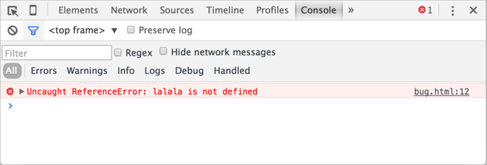
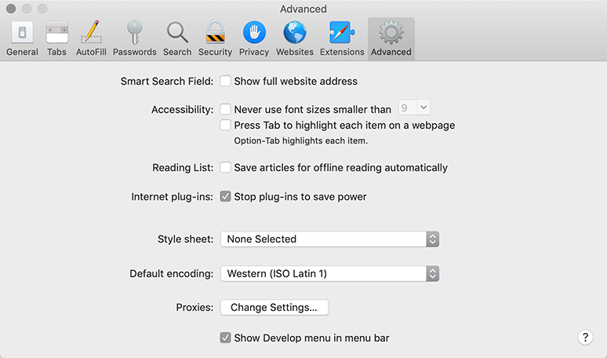

# Console do desenvolvedor

O código é propenso a erros. Você provavelmente cometerá erros ... Oh, do que estou falando? Você está * inevitavelmente * cometendo erros, pelo menos se você for um humano, não um [robô] (https://pt.wikipedia.org/wiki/Bender_Bending_Rodr%C3%ADguez).

Mas no navegador, os usuários não vêem os erros por padrão. Assim, se algo correr mal no script, não veremos de onde está partindo e não poderemos corrigir.

Para que possamos visualizar erros e obter muitas outras informações úteis sobre scripts, as "ferramentas de desenvolvedor" foram incorporadas aos navegadores.

A maioria dos desenvolvedores escolhem o Chrome ou o Firefox para o desenvolvimento porque esses navegadores têm as melhores ferramentas de desenvolvedor. Outros navegadores também fornecem ferramentas de desenvolvedor, às vezes com recursos especiais, mas geralmente estão jogando "catch-up" no Chrome ou Firefox. Assim, a maioria dos desenvolvedores tem um navegador "favorito" e muda para outros se um problema é específico do navegador.

As ferramentas do desenvolvedor são potentes; elas têm muitos recursos. Para começar, vamos aprender como abri-las, olhar para erros e executar comandos JavaScript.

## Google Chrome

Abra a página [bug.html](bug.html).

Há um erro no código JavaScript dela. Ele está escondido dos olhos de um visitante comum, então vamos abrir as ferramentas de desenvolvedor para vê-lo.

Pressione `key:F12` ou, se você estiver no Mac, então `key:Cmd+Opt+J`.

As ferramentas de desenvolvedor serão abertas na aba Console por padrão.

É parecido com isto:

O aspecto exato das ferramentas de desenvolvimento depende da sua versão do Chrome. Ele muda de vez em quando, mas deve ser semelhante.

- Aqui podemos ver a mensagem de erro de cor vermelha. Neste caso, o script contém um comando "lalala" desconhecido.
- À direita, há um link clicável para o código-fonte `bug.html:12` com o número da linha onde o erro ocorreu.

Abaixo da mensagem de erro, há um símbolo azul `>`. Ele marca uma "linha de comando" onde podemos digitar comandos JavaScript. Pressione `key:Enter` para executá-los (`key:Shift+Enter` para introduzir comandos multi-linha).

Agora podemos ver erros, e isso é suficiente para começar. Voltaremos mais tarde às ferramentas de desenvolvedor e abordaremos a depuração mais profundamente no capítulo <info:debugging-chrome>.

## Firefox, Edge, e outros

A maioria dos outros navegadores usam `key:F12` para abrir ferramentas de desenvolvimento.

A interface deles é bem parecida. Uma vez que você saiba como usar uma dessas ferramentas (você pode começar com o Chrome), você pode facilmente mudar para outra.

## Safari

O Safari (navegador do Mac, não suportado pelo Windows/Linux) é um pouco especial aqui. Precisamos primeiro habilitar o "Develop menu".

Abra Preferências e vá para o painel "Avançado". Há uma caixa de seleção na parte inferior:

Agora o `key:Cmd+Opt+C` pode alternar o console. Além disso, note que o novo item do menu superior chamado "Develop" apareceu. Ele tem muitos comandos e opções.

## Entrada multi-linha

Normalmente, quando colocamos uma linha de código no console, e então pressionamos `key:Enter`, ele executa.

Para inserir várias linhas, pressione `key:Shift+Enter`.

## Resumo

- As ferramentas de desenvolvedor nos permitem ver erros, executar comandos, examinar variáveis e muito mais.
- Elas podem ser abertas com `key:F12` para a maioria dos navegadores no Windows. O Chrome para Mac precisa de `key:Cmd+Opt+J`, Safari: `key:Cmd+Opt+C` (precisa ser ativado primeiro).

Agora temos o ambiente pronto. Na próxima seção, chegaremos ao JavaScript.