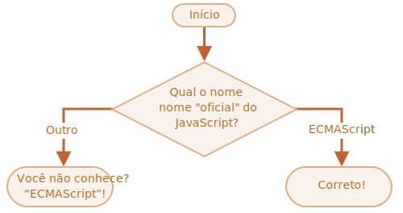

importance: 2

---

# O nome do JavaScript

Usando a construção `if..else`, escreva o código que pergunta: 'Qual é o nome "oficial" do JavaScript?'

Se o visitante digitar "ECMAScript", então chame a função `alert` passando como valor: "Correto!", caso contrário -- registre a seguinte mensagem: "Você não sabe? ECMAScript!"

[demo src="ifelse_task2"]
