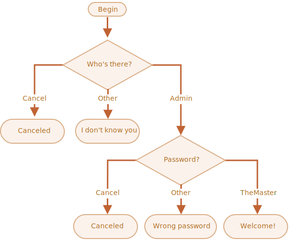

importância: 3

---

# Verifique o login

Escreva o código que irá perguntar por um login com um `prompt`.

Se o visitante digitar `"Admin"`, então faça `prompt` para a senha, se a entrada é uma linha vazia ou `key:Esc` -- mostre "Cancelado.", se for qualquer outra string -- então mostre "Eu não conheço você.".

A senha é checada da seguinte forma:

- Se for igual a "TheMaster", então mostre "Bem vindo!",
- Qualquer outra string -- mostre "Senha incorreta",
- Para uma string vazia ou cancelada, mostre "Cancelado.".

O esquema:

Use blocos agrupados de `if`s. Tenha em mente a legibilidade do código.

Dica: passar uma entrada vazia para um `prompt` retorna uma string vazia `''`. Pressionar `key:ESC` durante o `prompt` retorna `null`.

[demo]
