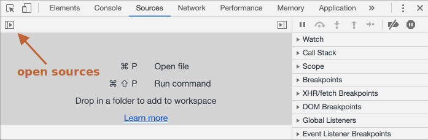

# Depuração de erros no Chrome

Antes de escrevermos código mais complexo, falemos de *debugging* (depuração de erros).

Todos os navegadores (*browsers*) modernos e muitas outras plataformas (*environments*) suportam "debugging" (depuração de erros) -- uma *UI* (Interface de Utilizador) disponível nas ferramentas do desenvolvedor (*developer tools*) que torna a tarefa de encontrar e fixar erros mais fácil.

Aqui vamos utilizar o Chrome, porque provavelmente é a mais rica em funcionalidades nesse aspecto.

## O painel "*sources*"

A versão do seu Chrome pode parecer um pouco diferente, mas ainda assim deveria ser óbvia a *UI*.

- Abra a [página exemplo](debugging/index.html) no Chrome.
- Ative ferramentas do desenvolvedor com `key:F12` (Mac: `key:Cmd+Opt+I`).
- Selecione o painel `sources`.

Aqui está o que poderá ver, se o estiver a fazer pela primeira vez:



O botão de alternador <span class="devtools" style="background-position:-168px -76px"></span> abre o separador com os ficheiros.

Cliquemos nele, e selecionemos `index.html` e depois `hello.js` na árvore de recursos apresentada. Aqui está o que deveria ser mostrado:


Aqui podemos ver três zonas:

1. A **zona Resources** lista ficheiros em HTML, JavaScript, CSS e outros, incluindo imagens anexadas à página. Extensões ao Chrome (*Chrome extensions*) podem também aparecer aqui.
2. A **zona Source** mostra o código-fonte.
3. A **zona Information and control** é para a depuração de erros (*debugging*); iremos explorá-la em breve.

Agora, poderia clicar novamente no mesmo botão de alternador <span class="devtools" style="background-position:-200px -76px"></span> para ocultar a lista de recursos e dar ao código algum espaço.

## Console

Se pressionarmos `Esc`, uma consola abre-se abaixo. Podemos digitar aí comandos e pressionar `key:Enter` para executá-los.

Depois de uma instrução ser executada, o seu resultado é mostrado abaixo.

Por exemplo, aqui `1+2` resulta em `3`, e `hello("debugger")` não retorna nada, assim o seu resultado é `undefined`:


## Breakpoints

Examinemos o que se passa dentro do código da [página exemplo](debugging/index.html). Em `hello.js`, clique no número de linha `4`. Sim, exatamente sobre o dígito `4` não sobre o código.

Parabéns! Estabeleceu um ponto-de-interrupção (*breakpoint*). Por favor, clique também no número de linha `8`.

Deveria parecer-se com (a azul é onde deveria ter clicado):


Um ponto-de-interrupção (*breakpoint*) é um ponto no código onde o depurador de erros (*debugger*) irá automáticamente suspender a execução de JavaScript.

Enquanto a execução do código estiver suspensa, podemos examinar variáveis atuais, executar comandos na consola, etc. Por outras palavras, podemos depurar erros nele (*debug it*).

No painel à direita, podemos encontrar uma lista de pontos-de-interrupção (*breakpoints*). É útil quando temos muitos *breakpoints* em vários ficheiros. Ela permite-nos:
- Rápidamente saltar para a linha do *breakpoint* no código (ao clicar sobre ele no painel à direita).
- Temporáriamente desativar o *breakpoint*, desmarcando-o (*uncheck*).
- Remover o *breakpoint*, clicando com o botão direito do rato e selecionando *Remove*.
- ...E por aí fora.

```smart header="Conditional breakpoints"
*Clicando com o botão direito do rato* sobre o número de linha permite-nos criar um *breakpoint* *condicional*. Apenas será ativado quando a expressão em causa for verdadeira.

É prático quando apenas precisarmos de parar para um certo valor de variável, ou para certos parâmetros de função.
```

## Comando *debugger*

Podemos também suspender o código utilizando o comando `debugger`, desta forma:

```js
function hello(name) {
  let phrase = `Olá, ${name}!`;

*!*
  debugger;  // <-- o *debugger* (depurador de erros) pára aqui
*/!*

  say(phrase);
}
```

É muito conveniente quando estivermos num editor de código e não quisermos mudar para o navegador (*browser*), e depois nas ferramentas do desenvolvedor deste procurar no programa (*script*) pelo local onde estabelecer o *breakpoint*.


## Pause e dê uma vista de olhos

No nosso exemplo, `hello()` é chamada durante o carregamento da página. Assim a forma mais fácil de ativar o depurador de erros (*debugger*) é, depois de estabelecer o *breakpoint*, refrescar (*reload*) a página. Então, primamos `key:F5` (*Windows*, *Linux*) ou `key:Cmd+R` (*Mac*).

Se o *breakpoint* estiver marcado, a execução pára na quarta linha:


Por favor, abra as secções de *dropdown* informacionais à direita (com etiquetas em seta). Elas permitem examinar o estado atual do código:

1. **`Watch` -- mostra valores atuais para uma expressão.**

    Pode clicar no mais `+` e inserir uma expressão. O *debugger* mostrará o seu valor em qualquer momento, automáticamente o recalculando ao longo do processo de execução.

2. **`Call Stack` -- mostra a cadeia de chamadas aninhadas (*nested calls*).**

    No momento, o *debugger* está dentro da chamada a `hello()`, invocada por código (*script*) em `index.html` (não a partir de uma função nele, por isso o nome "anonymous").

    Se clicar num item na pilha (*stack*), o *debugger* saltará para o código correspondente, e todas as suas variáveis poderão ser também examinadas.
3. **`Scope` -- variables atuais.**

    `Local` mostra variáveis locais de funções. Poderá também ver os seus valores destacados exatamente sobre o código-fonte.

    `Global` possui variáveis globais (aquelas fora de qualquer função).

    Lá também existe a palavra-chave `this`, que ainda não estudámos mas o faremos em breve.

## Rastreando a execução

Agora, é altura para *rastrearmos* (*trace*) o código (*script*).

Existem botões para isso no topo do painel direito. Interajámos com eles.

<span class="devtools" style="background-position:-7px -76px"></span> -- continue a execução, atalho (*hotkey*) `key:F8`.
: Retoma a execução. Se não houver *breakpoints* adicionais, a execução simplesmente continua e o *debugger* perde o controlo.

    Aqui está o que poderemos ver após um clique sobre ele:

    

    A execução prosseguiu, atingiu outro *breakpoint* dentro de `say()` e parou lá. Dê uma vista de olhos sobre a "*Call stack*" à direita. Aumentou por mais de uma chamada. Estamos dentro de `say()` agora.

<span class="devtools" style="background-position:-137px -76px"></span> -- dê um passo (*make a step*), execute o próximo comando (*run the next command*), mas *mas não vá para dentro da função*, atalho `key:F10`.
: Se o clicarmos agora, `alert` será executada. O importante é que `alert` pode ser qualquer função, a execução "passa sobre ela" ("*steps over it*"), evitando as particularidades do funcionamento interno da função.

<span class="devtools" style="background-position:-72px -76px"></span> -- dê um passo (*make a step*), atalho `key:F11`.
: O mesmo que anteriormente, mas "passa para dentro" ("*steps into*") de funções. Clicando neste, todas as ações do *script* serão executadas, uma a uma.

<span class="devtools" style="background-position:-104px -76px"></span> -- continue a execução até ao fim da função atual, atalho `key:Shift+F11`.
: A execução pararia na última linha da função atual. É útil quando acidentalmente entrámos para uma chamada aninhada (*nested call*) <span class="devtools" style="background-position:-72px -76px"></span>, mas ela não nos interessa, e queremos prosseguir para o seu final o mais rápidamente possível.

<span class="devtools" style="background-position:-7px -28px"></span> -- ative/desative todos os *breakpoints*.
: Esse botão não move a execução. Simplesmente liga/desliga *breakpoints* em massa.

<span class="devtools" style="background-position:-264px -4px"></span> -- ative/desative a pausa automática em caso de erro.
: Quando ativo, e as ferramentas do desenvolvedor estão abertas, um erro no código (*script*) automáticamente suspende a sua execução. Então, poderemos analizar variáveis para ver o que ocorreu de errado. Assim, se o código falhar por um erro desconhecido, poder-se-á abrir o *debugger*, ativar esta opção e refrescar a página afim de observar onde falhou e qual o contexto nesse momento.

```smart header="Continue to here"
Ao clicar com o botão direito do rato sobre uma linha de código, abre-se o menu de contexto com uma valiosa opção com o nome "*Continue to here*" (Continue até aqui).

É prática quando quisermos mover adiante por múltiplos passos, mas estamos preguiçosos demais para estabelecer um *breakpoint*.
```

## Logging

Para mostrar algo na consola, existe a função `console.log`.

Por exemplo, isto mostra os valores de `0` a `4` na consola:

```js run
// abra a consola para visualizar
for (let i = 0; i < 5; i++) {
  console.log("valor", i);
}
```

Utilizadores comuns não vêm essa saída (*output*), ela estará na consola. Para a ver, abra o separador Console das ferramentas do desenvolvedor ou, se já nas ferramentas, pressione `key:Esc` enquanto num outro separador - isso abre a consola abaixo nesse separador.

Se tivermos mensagens (*logging*) suficientes no nosso código, poderemos ver o que nele se passa sem o *debugger*.

## Sumário

Como podemos ver, existem três formas principais de suspender um *script*:
1. Um *breakpoint* (ponto-de-interrupção).
2. As instruções `debugger`.
3. Um erro (se *dev tools* [ferramentas do desenvolvedor] estiverem abertas, e o botão <span class="devtools" style="background-position:-264px -4px"></span> estiver "ativo").

Então, poderemos examinar as variáveis, e dar passos (*step on*) para ver onde a execução apresenta erros.

Existem muitas mais opções nas ferramentas do desenvolvedor do que as cobertas aqui. O manual completo está em <https://developers.google.com/web/tools/chrome-devtools>.

A informação neste capítulo é suficiente para iniciar a depuração de erros (o *debugging*), mas mais tarde, especialmente se trabalhar muito no navegador (*browser*), por favor vá e procure por capacidades mais avançadas das ferramentas do desenvolvedor.

Oh, também pode clicar em vários locais nas *dev tools* e ver o que acontece. Provávelmente, é a rota mais rápida para aprender sobre as *dev tools*. Não se esqueça de também clicar com o botão direito do rato!
