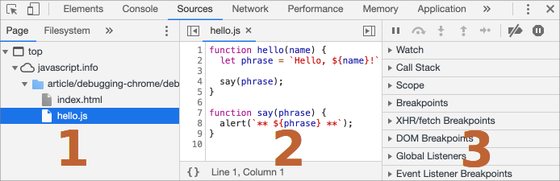

# Depuração de erros no Chrome

Antes de escrevermos código mais complexo, vamos falar de debugging (depuração de erros).

[Depuração](https://pt.wikipedia.org/wiki/Depura%C3%A7%C3%A3o) é o processo de procura e correção de erros num programa. Todos os navegadores (*browsers*) modernos e muitas outras plataformas (*environments*) suportam ferramentas de *debugging* -- uma UI (Interface de Utilizador) disponível nas ferramentas do desenvolvedor (*developer tools*) que torna a depuração de erros muito mais fácil. Ela também permite rastrear o código passo-a-passo para ver exactamente o que está a ser executado.

Aqui, vamos utilizar o Chrome porque tem bastantes funcionalidades, mas a maioria dos outros navegadores possuem um processo similar.

## O painel "*Sources*"

A versão do seu Chrome pode parecer um pouco diferente, mas ainda assim deveria ser óbvio o que lá encontre.

- Abra a [página exemplo](debugging/index.html) no Chrome.
- Ative as ferramentas do desenvolvedor com `key:F12` (Mac: `key:Cmd+Opt+I`).
- Selecione o painel `Sources`.

Aqui está o que poderá ver, se o estiver a fazer pela primeira vez:


O botão de alternador <span class="devtools" style="background-position:-172px -98px"></span> abre o separador com os ficheiros.

Vamos clicar nele, e selecionar `hello.js`  na vista de árvore de recursos apresentada. Aqui está o que deveria ser mostrado:



O painel *Sources* possui 3 partes:

1. O painel **File Navigator**, lista ficheiros de HTML, JavaScript, CSS e outros, incluindo imagens anexadas à página. Extensões ao Chrome (*Chrome extensions*) também podem aparecer aqui.
2. O painel **Code Editor**, mostra o código-fonte.
3. O painel **JavaScript Debugging**, é para a depuração de erros; iremos explorá-lo em breve.

Agora, poderia clicar novamente no mesmo botão de alternador <span class="devtools" style="background-position:-172px -122px"></span> para ocultar a lista de recursos e dar ao código algum espaço.

## Console

Se pressionarmos `key:Esc`, uma consola se abre abaixo. Podemos aí digitar comandos e pressionar `key:Enter` para os executar.

Depois de uma instrução ser executada, o seu resultado é mostrado abaixo.

Por exemplo, aqui `1+2` resulta em `3`, e `hello("debugger")` não retorna nada, assim o seu resultado é `undefined`:


## Breakpoints

Vamos examinar o que se passa dentro do código da  [página exemplo](debugging/index.html). Em `hello.js`, clique no número de linha `4`. Sim, exatamente sobre o dígito `4`, não sobre o código.

Parabéns! Estabeleceu um ponto-de-interrupção (*breakpoint*). Por favor, clique também no número de linha `8`.

Deveria se parecer com (a azul é onde deveria ter clicado):


Um *breakpoint* é um ponto no código onde o *debugger* (depurador de erros) irá automáticamente efetuar uma pausa na execução do JavaScript.

Enquanto a execução do código estiver suspensa, podemos examinar variáveis correntes, executar comandos na consola, etc. Por outras palavras, podemos nele depurar erros (*debug it*).

Podemos sempre encontrar uma lista de *breakpoints* no painel à direita. É útil quando temos muitos *breakpoints* em vários ficheiros. Ela permite-nos:

- Rápidamente saltar para a linha do breakpoint no código (ao clicar sobre ele no painel à direita).
- Temporáriamente desativar o breakpoint, ao desmarcá-lo (*unchecking it*).
- Remover o breakpoint, clicando com o botão direito do rato e selecionando *Remove*.
- ...E assim por diante.

```smart header="*Breakpoints* condicionais"
*Clicando com o botão direito do rato* sobre um número de linha permite-nos criar um *breakpoint condicional*. Apenas será ativado quando a expressão inserida for verdadeira.

É prático quando apenas precisarmos de parar para um certo valor numa variável, ou para certos parâmetros numa função.
```

## O comando *debugger*

Podemos também suspender o código utilizando o comando `debugger`, desta forma:

```js
function hello(name) {
  let phrase = `Olá, ${name}!`;

*!*
  debugger;  // <-- o *debugger* (depurador de erros) pára aqui
*/!*

  say(phrase);
}
```

É muito conveniente quando estivermos num editor de código e não quisermos mudar para o navegador, e de seguida, nas ferramentas do desenvolvedor deste, procurar no programa (*script*) pelo local onde colocar o breakpoint.

## Pause e dê uma vista de olhos

No nosso exemplo, `hello()` é chamada durante o carregamento da página, assim a forma mais fácil para ativar o *debugger* (depois de termos colocado os *breakpoints*) é refrescar (*reload*) a página. Assim, vamos pressionar `key:F5` (Windows, Linux) ou `key:Cmd+R` (Mac).

Como o breakpoint está estabelecido, é feita uma pausa na execução na quarta linha:


Por favor, abra as secções de dropdown informacionais à direita (possuem etiquetas em seta). Elas permitem examinar o estado atual do código:

1. **`Watch` -- mostra valores correntes de expressões.**

    Pode clicar no mais `+` e inserir uma expressão. O *debugger* mostrará o seu valor em qualquer momento, e é automáticamente recalculado ao longo do processo de execução.

2. **`Call Stack` -- mostra a sequência de chamadas de funções aninhadas.**

    No presente momento, o *debugger* está dentro da chamada a `hello()`, invocada por código em `index.html` (não a partir de uma função, por isso o nome "*anonymous*").

    Se clicar num item nessa pilha (*stack*) (por exemplo, em "*anonymous*"), o *debugger* saltará para o código correspondente, e todas as suas variáveis poderão ser igualmente examinadas.

3. **`Scope` -- variables atuais.**

    `Local` mostra variáveis locais de funções. Também, poderá ver os seus valores em destaque exatamente sobre o código-fonte.

    `Global` possui variáveis globais (aquelas fora de qualquer função).

    Lá também existe a palavra-chave `this` que ainda não estudámos, mas o faremos em breve.

## Rastreando a execução

Agora, é altura para *rastrearmos* (*trace*) o código.

Existem botões para isso no topo do painel direito. Vamos interagir com eles.

<span class="devtools" style="background-position:-146px -160px"></span> -- "Resume": continue a execução, atalho (*hotkey*) `key:F8`.
: Retoma a execução. Se não houver *breakpoints* adicionais, a execução simplesmente prossegue e o *debugger* perde o controlo.

  Aqui está o que poderemos ver após um clique sobre ele:

  

  A execução prosseguiu, atingiu outro *breakpoint* dentro de `say()` e foi suspensa lá. Dê uma vista de olhos sobre a "*Call stack*" à direita. Aumentou por mais uma chamada. Estamos dentro de `say()` agora.

<span class="devtools" style="background-position:-200px -190px"></span> -- "Step": execute o próximo comando, atalho (*hotkey*) `key:F9`.
: Executa a próxima instrução. Se o clicarmos agora, o `alert` será mostrado.

  Continuando a clicar nele, passará por todas as instruções do programa, uma por uma.

<span class="devtools" style="background-position:-62px -192px"></span> -- "Step over": execute o próximo comando, mas *mas não vá para dentro de uma função*, atalho `key:F10`.
: Similar ao comando "Step" anterior, mas com um comportamento diferente se a próxima instrução for uma chamada de função. Isto é: não uma incorporada (*built-in*), como `alert`, mas uma função sua.

  O comando "Step", vai para dentro dela e suspende a execução na sua primeira linha, ao contrário de "Step over" que executa essa chamada de função aninhada invisívelmente, saltando sobre o funcionamento interno da função.

  É feita uma pausa na execução imediatemente depois dessa função.

  É bom, se não estivermos interessados em ver o que acontece dentro da chamada de função.

<span class="devtools" style="background-position:-4px -194px"></span> -- "Step into", atalho `key:F11`.
: Similar a "Step", mas com um comportamento diferente no caso de chamadas de funções assíncronas. Se estiver a começar a aprender JavaScript, então poderá ignorar a diferença, porque ainda não temos chamadas assíncronas.

  Futuramente, apenas tome nota que o comando "Step" ignora ações assíncronas, tais como `setTimeout` (chamada de função agendada), que são executadas mais tarde. O "Step into", vai para dentro do seu código, esperando pela sua execução se necessário. Para mais detalhes, veja o [DevTools manual](https://developers.google.com/web/updates/2018/01/devtools#async).

<span class="devtools" style="background-position:-32px -194px"></span> -- "Step out": continue a execução até ao fim da função atual, atalho `key:Shift+F11`.
: Continue a execução e a faça uma pausa na última linha da função atual. É útil quando acidentalmente entrámos para uma chamada aninhada usando <span class="devtools" style="background-position:-200px -190px"></span>, mas ela não nos interessa, e queremos prosseguir para o seu final o mais rápidamente possível.

<span class="devtools" style="background-position:-61px -74px"></span> -- ative/desative todos os *breakpoints*.
: Esse botão não move a execução. Simplesmente liga/desliga *breakpoints* em grupo.

<span class="devtools" style="background-position:-90px -146px"></span> -- ative/desative a pausa automática em caso de erro.
: Quando ativo, e as ferramentas do desenvolvedor estão abertas, um erro no código automáticamente suspende a sua execução. Então, poderemos analizar variáveis para ver o que ocorreu de errado. Assim, se o código falhar por um erro, pode-se abrir o *debugger*, ativar esta opção e refrescar a página, afim de se observar onde falhou e qual o contexto nesse momento.

```smart header="Continue até aqui"
Ao clicar com o botão direito do rato sobre uma linha de código, abre-se o menu de contexto com uma valiosa opção com o nome "Continue até aqui" (*Continue to here*).

É prática quando quisermos mover adiante por múltiplos passos até essa linha, mas estamos preguiçosos demais para estabelecer um *breakpoint*.
```

## Logging

Para mostrar algo existente no código na consola, existe a função `console.log`.

Por exemplo, isto mostra os valores de `0` a `4` na consola:

```js run
// abra a consola para visualizar
for (let i = 0; i < 5; i++) {
  console.log("valor,", i);
}
```

Utilizadores comuns não vêm essa saída (*output*), ela estará na consola. Para a ver, abra o separador Console nas ferramentas do desenvolvedor, ou pressione `key:Esc` se estiver num outro separador - isso abre a consola abaixo nesse separador.

Se mostrarmos mensagens (*logging*) suficientes no nosso código, então poderemos ver o que nele se passa a partir desses registos, dispensando o *debugger*.

## Resumo

Como podemos ver, existem três formas principais para efetuar uma pausa num *script*:
1. Um *breakpoint* (ponto-de-interrupção).
2. As instruções `debugger`.
3. Um erro (se as ferramentas do desenvolvedor [*dev tools*] estiverem abertas, e o botão <span class="devtools" style="background-position:-90px -146px"></span> estiver "ativo").

Enquanto suspenso, podemos depurar erros - examinar variáveis e rastear o código para ver onde a sua execução contém erros.

Existem muitas mais opções nas ferramentas do desenvolvedor do que as cobertas aqui. O manual completo está em <https://developers.google.com/web/tools/chrome-devtools> (no topo, à direita, poderá escolher o idioma).

A informação neste capítulo é suficiente para iniciar a depuração de erros (o *debugging*), mas mais tarde, especialmente se trabalhar muito com o navegador (*browser*), por favor consulte o manual e procure por capacidades mais avançadas de ferramentas do desenvolvedor.

Oh, também pode clicar em vários locais nas *dev tools* e ver o que acontece. Provávelmente, é a rota mais rápida para aprender sobre as *dev tools*. Não se esqueça de também clicar com o botão direito do rato e dos menus de contexto!
