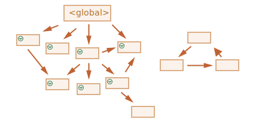

# *Garbage collection*

A gestão de memória em JavaScript é feita automaticamente, e é invisível para nós. Nós criamos primitivos, objetos, funções... Tudo o que ocupa memória.

O que acontece quando algo não é mais necessário? Como o interpretador de JavaScript (*JavaScript engine*) o descobre e o limpa?

## Acessibilidade

O principal conceito para a gestão de memória em JavaScript é o de *acessibilidade* (*reachability*).

Simplesmente dito, valores "alcançáveis" (reachable) são aqueles que de alguma forma podem ser acedidos ou utilizados. Eles têm a garantia de estar armazenados em memória.

1. Existe um conjunto básico de valores inerentemente alcançáveis, que não podem ser apagados por razões óbvias.

    Por exemplo:

    - A função no momento em execução, e as suas variáveis locais e parâmetros.
    - Outras funções no momento na cadeia de chamadas aninhadas (*nested calls*), e as suas variáveis locais e parâmetros.
    - Variáveis globais.
    - (existem outros, incluindo internos)

    Estes valores são chamados de *raízes* (*roots*).

2. Qualquer outro valor é considerado alcançável, se puder ser acedido a partir de um valor *root* por meio de uma referência ou sequência de referências.

    Por exemplo, se existir um objeto numa variável local, e esse objeto tiver uma propriedade a referenciar um outro objeto, este objeto é considerado alcançável. E aqueles aos quais ele referenciar também o são. Exemplos detalhados a seguir.

Existe um processo de fundo (*background process*) no interpretador de JavaScript, chamado de [coletor de lixo](https://pt.wikipedia.org/wiki/Coletor_de_lixo_(inform%C3%A1tica)) (*garbage collector*). Ele monitora todos os objetos, e remove aqueles que se tornaram inalcançáveis.

## Um exemplo simples

Aqui está o mais simples exemplo:

```js
// 'user' tem uma referência para um objeto
let user = {
  name: "John"
};
```


Aqui, a seta mostra uma referência para um objeto. A variável global `"user"` referencia o objeto `{name: "John"}` (vamos o chamar de John para abreviar). A propriedade `"name"` de John armazena um primitivo, por isso é desenhada dentro do objeto.

Se o valor de `user` for substituído, a referência é perdida:

```js
user = null;
```


Agora, John se torna inalcançável. Não há forma de o aceder, nenhuma referência para ele. O coletor de lixo irá por os dados na lixeira, e libertar a memória.

## Duas referências

Agora, vamos imaginar que copiamos a referência de `user` para `admin`:

```js
// 'user' tem uma referência para o objeto
let user = {
  name: "John"
};

*!*
let admin = user;
*/!*
```


Agora, se fizermos o mesmo:
```js
user = null;
```

...Aí, o objeto ainda pode ser alcançado por intermédio da variável global `admin`, por isso continua em memória. Se também atribuirmos outro valor a `admin`, então ele pode ser removido.

## Objetos interligados

Agora, um exemplo mais complexo. A familia:

```js
function marry(man, woman) {
  woman.husband = man;
  man.wife = woman;

  return {
    father: man,
    mother: woman
  }
}

let family = marry({
  name: "John"
}, {
  name: "Ann"
});
```

A função `marry` "casa" dois objetos dando-lhes referências recíprocas, e retorna um novo objeto contendo ambos.

A estrutura resultante em memória :


Por ora, todos os objetos são alcançáveis.

Agora, vamos remover duas referências:

```js
delete family.father;
delete family.mother.husband;
```


Não é suficiente eliminar apenas uma destas duas referências, porque todos os objetos ainda estariam acessíveis.

Mas se eliminarmos ambas, então poderemos ver que John já não tem nenhuma referência para ele (*incoming*):


Referências de saída (*outgoing*) não interessam. Apenas as de entrada (*incoming*) podem tornar um objeto alcançável. Portanto, John está agora inalcançável e será removido da memória, com todos os seus dados porque também se tornaram inacessíveis.

Após a coleta de lixo (*garbage collection*):


## Ilha inacessível

É possível que toda a ilha de objetos interligados se torne inalcançável e seja removida da memória.

 O objeto fonte é o mesmo de acima. Se:

```js
family = null;
```

A imagem em memória se torna:


Este exemplo demonstra o quão importante é o conceito de acessibilidade.

É óbvio que John e Ann ainda estão conetados, ambos têm referências de entrada (*incoming*). Mas, isso não é o suficiente.

O antigo objeto `"family"` foi desconectado da raiz, não existe mais alguma referência para ele, assim toda a ilha se torna inalcançável e será removida.

## Algoritmos internos

O  algoritmo básico de coleta de lixo é chamado de "marcar-e-varrer" ("*mark-and-sweep*").

Os passos seguintes, para a "coleta de lixo" são executados periódicamente:

- O coletor de lixo toma raízes e as "marca" (se recorda delas).
- Depois, visita e "marca" todas as referências que saiam delas.
- A seguir, ele visita os objetos marcados e marca as referências *destes*. Todos os objetos visitados são recordados, para não visitar o mesmo objeto no futuro.
- ...E assim por diante, até que todas as referências alcançáveis (a partir das *roots*) sejam visitadas.
- Todos os objetos, com exceção dos marcados, são removidos.

Por exemplo, se a nossa estrutura de objetos se parecer a esta:


Claramente, vemos uma "ilha inalcançável" no lado direito. Agora, vamos ver como o *garbage collector* "*mark-and-sweep*" lida com ela.

O primeiro passo, marca as raízes (*roots*):


A seguir, as referências delas são marcadas:



...E as referências destas, o quanto possível:


Agora, os objetos que não puderam ser visitados no processo são considerados inalcançáveis e serão removidos:


Podemos também imaginar o processo como derramar um enorme balde de tinta a partir das raízes,  que corre por todas as referências e marca todos os objetos que alcança. Os não marcados, são então removidos.

Este, é o conceito de como funciona a coleta de lixo. Interpretadores de JavaScript (*JavaScript engines*) aplicam muitas optimizações para a fazer correr mais rapidamente, e não afetar a execução do programa.

Algumas das optimizações:

- **Generational collection** (coleta geracional) -- objetos são separados em dois grupos: "novos" e "velhos". Muitos objetos aparecem, fazem o seu trabalho e terminam depressa, eles podem ser limpos agressivamente. Aqueles que sobrevivem por mais tempo, tornam-se "velhos" e são examinados com menos frequência.
- **Incremental collection** (coleta incremental) -- se existirem muitos objetos, e tentarmos percorrer e marcar todo o conjunto de objetos de uma só vez, pode levar algum tempo e introduzir visíveis atrasos na execução do programa. Assim, o interpretador tenta repartir a coleta de lixo em pedaços. Então, os pedaços são executados um por um, separadamente. Isso, requere alguma anotação (*bookkeeping*) extra entre eles para rastrear alterações, mas temos muitos pequeninos atrasos em vez de um único grande.
- **Idle-time collection** (coleta no tempo ocioso) -- o coletor de lixo tenta apenas correr quando o CPU estiver parado, para reduzir possíveis efeitos sobre a execução do programa.

Existem outras optimizações e sabores de algoritmos para a coleta de lixo. Embora gostasse de os descrever aqui, tenho de parar porque interpretadores diferentes implementam diferentes adaptações (*tweaks*) e técnicas. E ainda mais importante, as coisas mudam à medida que os interpretadores evoluem, assim estudar em pormenor "adiantadamente", sem uma necessidade real provavelmente não vale o esforço. A não ser claro, por puro interesse, e para isso haverão alguns links para si abaixo.

## Sumário

As principais coisas a saber:

- A coleta de lixo é executada automaticamente. Não a podemos forçar nem evitar.
- Objetos são retidos em memória enquanto forem alcançáveis.
- Ser referenciado não é o mesmo que ser alcançável (a partir de uma raíz): um grupo de objetos interligados pode se tornar inacessível no seu todo.

Interpretadores modernos implementam algoritmos avançados para a coleta de lixo.

O livro geral "The Garbage Collection Handbook: The Art of Automatic Memory Management" (R. Jones et al), cobre alguns deles.

Se tiver familiaridade com programação de baixo-nível, mais detalhada informação sobre o coletor de lixo de V8 está no artigo [A tour of V8: Garbage Collection](http://jayconrod.com/posts/55/a-tour-of-v8-garbage-collection).

O [V8 blog](https://v8.dev/) também publica artigos sobre alterações na gestão de memória de tempos em tempos. Naturalmente, para aprender sobre a coleta de lixo, melhor seria preparar-se aprendendo sobre o funcionamento interno do V8 em geral, e ler o blog de [Vyacheslav Egorov](http://mrale.ph) que trabalhou como um dos engenheiros do V8. Digo "V8", porque é o que contém melhores artigos na internet. Para outros interpretadores, muitas abordagens são similares, porém a coleta de lixo difere em muitos aspetos.

Conhecimento aprofundado sobre interpretadores é bom para quando precisar de optimizações de baixo-nível. Seria sábio planear isso como próximo passo, depois de se familiarizar com a linguagem.  
