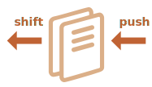
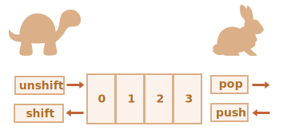
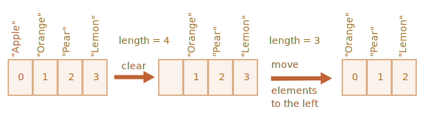

# *Arrays*

Objetos permitem-lhe armazenar coleções de valores por chaves. É bom.

Mas, frequentemente precisamos de uma *coleção ordenada*, onde tenhamos um 1º, 2º, 3º elemento e assim por diante. Por exemplo, precisamos dela para armazenar uma lista de algo como: visitantes, bens, elementos de HTML, etc.

Não é conveniente usar um objeto aqui, porque ele não dispõe de métodos para gerir a ordem dos elementos. Não podemos inserir uma nova propriedade “entre” outras já existentes. Objetos simplesmente não são adequados a tal uso.

Existe uma estrutura de dados especial chamada `Array`,  para armazenar coleções ordenadas.

## Declaração

Existem duas sintaxes para criar um *array* vazio:

```js
let arr = new Array();
let arr = [];
```

Quase sempre é usada a segunda sintaxe. Também podemos fornecer elementos iniciais entre os parênteses:

```js
let fruits = ["Maçã", "Laranja", "Ameixa"];
```

Os elementos de um *array* são numerados, começando por zero.

Podemos obter um elemento pelo seu número entre parênteses retos:

```js run
let fruits = ["Maçã", "Laranja", "Ameixa"];

alert( fruits[0] ); // Maçã
alert( fruits[1] ); // Laranja
alert( fruits[2] ); // Ameixa
```

Podemos substituir um elemento:

```js
fruits[2] = 'Pêra'; // now ["Maçã", "Laranja", "Pêra"]
```

...Ou adicionar um novo ao *array*:

```js
fruits[3] = 'Limão'; // now ["Maçã", "Laranja", "Pêra", "Limão"]
```

O número total dos elementos no *array* é o seu `*length*` (comprimento):

```js run
let fruits = ["Maçã", "Laranja", "Ameixa"];

alert( fruits.length ); // 3
```

Podemos também usar `alert` para exibir todo o *array*.

```js run
let fruits = ["Maçã", "Laranja", "Ameixa"];

alert( fruits ); // Maçã,Laranja,Ameixa
```

Um *array* pode armazenar elementos de qualquer tipo.

Por exemplo:

```js run no-beautify
// mistura de valores
let arr = [ 'Maçã', { name: 'John' }, true, function() { alert('olá'); } ];

// obtenha o objeto no índice 1 e a seguir mostre o seu nome
alert( arr[1].name ); // John

// obtenha a função no índice 3 e a execute
arr[3](); // olá
```


````smart header="Vírgula final"
Um array, tal como um objeto, pode terminar por uma vírgula:
```js
let fruits = [
  "Maçã",
  "Laranja",
  "Ameixa"*!*,*/!*
];
```

O estilo de "vírgula final" torna mais fácil inserir/remover itens, porque todas as linhas se tornam semelhantes.
````


## Métodos pop/push, shift/unshift

Uma [queue](https://en.wikipedia.org/wiki/Queue_(abstract_data_type)) (*fila*) é um dos usos mais comuns de um *array*. Em ciência dos computadores, isto significa uma coleção ordenada de elementos que suporta duas operações:

- `push` adiciona um elemento ao final.
- `shift` obtém um elemento do início, avançando a fila, de modo que o 2º elemento se torne no 1º.



Os *arrays* suportam ambas as operações.

Na prática, nós a precisamos com muita frequência. Por exemplo, uma fila de mensagens que precisa de ser mostrada no ecrã.

Existe um outro caso prático para *arrays* -- a estrutura de dados chamada [pilha](https://pt.wikipedia.org/wiki/Pilha_(inform%C3%A1tica)) (*stack*).

Ela suporta duas operações:

- `push` adiciona um elemento ao final.
- `pop` toma um elemento do final.

Assim, novos elementos são adicionados ou tomados sempre ao/do "final".

Uma pilha (*stack*) é geralmente ilustrada como um baralho de cartas: novas cartas são adicionadas ao topo ou tiradas do topo:


Para pilhas, o último item inserido é recebido primeiro, o que também é chamado de princípio *LIFO* (*Last-In-First-Out*) (o-Último-a-Entrar-é-o-Primeiro-a-Sair). Para filas (*queues*), nós temos *FIFO* (*First-In-First-Out*) (o-Primeiro-a-Entrar-é-o-Primeiro-a-Sair).

Os *arrays* em JavaScript tanto podem  trabalhar como uma fila, como também uma pilha. Eles permitem-lhe adicionar/remover elementos quer ao/do início como ao/do final.

Em ciência dos computadores, a estrutura de dados que permite isto é chamada de [deque](https://pt.wikipedia.org/wiki/Deque_(estruturas_de_dados)).

**Métodos que trabalham no final do _array_:**

`*pop*`
: Extrai o último elemento do *array* e o retorna:

    ```js run
    let fruits = ["Maçã", "Laranja", "Pêra"];

    alert( fruits.pop() ); // remove "Pêra" e o exibe

    alert( fruits ); // Maçã, Laranja
    ```

`*push*`
: Adiciona o elemento ao final do *array*:

    ```js run
    let fruits = ["Maçã", "Laranja"];

    fruits.push("Pêra");

    alert( fruits ); // Maçã, Laranja, Pêra
    ```

    A chamada `fruits.push(...)` é igual a `fruits[fruits.length] = ...`.

**Métodos que trabalham no início do _array_:**

`*shift*`
: Extrai o primeiro elemento do *array* e o retorna:

    ```js
    let fruits = ["Maçã", "Laranja", "Pêra"];

    alert( fruits.shift() ); // remove Maçã e o exibe

    alert( fruits ); // Laranja, Pêra
    ```

`*unshift*`
: Adiciona o elemento ao início do *array*:

    ```js
    let fruits = ["Laranja", "Pêra"];

    fruits.unshift('Maçã');

    alert( fruits ); // Maçã, Laranja, Pêra
    ```

Os métodos `*push*` e `*unshift*` podem adicionar múltiplos elementos de uma só vez:

```js run
let fruits = ["Maçã"];

fruits.push("Laranja", "Pêssego");
fruits.unshift("Ananás", "Limão");

// ["Ananás", "Limão", "Maçã", "Laranja", "Pêssego"]
alert( fruits );
```

## Internamente

Um *array* é um tipo especial de objeto. Os parêntesis retos usados para aceder a uma propriedade `arr[0]` vêm, na verdade, da sintaxe de objetos. Isto, é essencialmente o mesmo que `obj[key]`, onde `arr` é o objeto, e números são usados como chaves.

Eles são uma extensão aos objetos, fornecendo métodos especiais para trabalhar com coleções ordenadas de dados e também a propriedade `length`. Assim, no seu núcleo um *array* é um objeto.

Lembre-se, só existem oito tipos de dados básicos em JavaScript (veja o capítulo [Tipos de dads](info:types) para mais informação). O *array* é um objeto e portanto comporta-se como um objeto.

Por exemplo, ele é copiado por referência:

```js run
let fruits = ["Banana"]

let arr = fruits; // cópia por referência (duas variáveis referenciam o mesmo array)

alert( arr === fruits ); // true (verdadeiro)
 
arr.push("Pêra"); // modifique o array por referência

alert( fruits ); // Banana, Pêra - 2 itens agora
```

...Mas, o que torna os *arrays* realmente  especiais é a sua representação interna. O interpretador de JavaScript tenta armazenar os seus elementos numa área contígua de memória, um após outro, precisamente como mostrado nas ilustrações deste capítulo, e existem também outras optimizações para fazerem os *arrays* trabalhar verdadeiramente rápido.

Mas, todas elas quebram se pararmos de trabalhar com um *array* como uma "coleção ordenada", e começarmos a trabalhar com ele como se fosse um objeto regular.

Por exemplo, tecnicamente nós podemos fazer isto:

```js
let fruits = []; // cria um array

fruits[99999] = 5; // atribui uma propriedade com um índice muito maior do que o seu comprimento

fruits.age = 25; // cria uma propriedade com um nome arbitrário
```

Isso é possível, porque *arrays* são objetos na sua base. Podemos adicionar qualquer propriedade a eles.

Mas, o interpretador irá ver que nós estamos a trabalhar com o *array* como com um objeto regular. Optimizações especificas para *arrays* não são adequadas a tais casos e serão desativadas, os seus benefícios desaparecem.

Formas de má utilização de um *array*:

- Adicionar uma propriedade não-numérica como `arr.test = 5`. 
- Formar buracos, como: adicionar `arr[0]` e depois `arr[1000]` (e nada entre eles).
- Preencher o *array* por ordem inversa, como `arr[1000]`, `arr[999]` e assim por diante.

Por favor, pense em *arrays* como estruturas especiais para trabalhar com *dados ordenados*. Eles fornecem métodos especiais para isso. *Arrays* são cuidadosamente afinados dentro dos interpretadores de JavaScript (*JavaScript engines*) para trabalharem com dados ordenados contíguos, por favor os utilize dessa forma. E, se precisar de chaves arbitrárias, são altas as chances de que na verdade necessite de um objeto regular `{}`.

## Performance

Os métodos `push/pop` correm rápidamente, enquanto `shift/unshift` são lentos.



Porque é mais rápido trabalhar  no final de um *array*, do que no seu início? Vejamos o que acontece durante a execução:

```js
fruits.shift(); // tome 1 elemento do início
```

Não é suficiente tomar e remover o elemento com o número `0`. Os outros elementos também precisam de ser renumerados.

A operação `shift` deve efetuar 3 coisas:

1. Remover o elemento com o índice `0`.
2. Mover todos os elementos para a esquerda, renumerando-os do índice `1` para `0`, do `2` para `1`, e assim por diante.
3. Atualizar a propriedade `length`.



**Quantos mais elementos no *array*, mais tempo se leva para os mover, e mais operações em memória.**

A semelhança acontece com `unshift`: para adicionar um elemento ao início do *array*, nós primeiro precisamos de mover os elementos existentes para à direita, aumentando os seus indices.

E, o que se passa com `push/pop`? Eles, não precisam de mover nada. Para extrair um elemento do final, o método `pop` limpa o índice e diminui `length`.

As ações para a operação `pop`:

```js
fruits.pop(); // tome 1 elemento do final
```


**O método `pop` não precisa de mover nada, porque os outros elementos mantêm os seus indices. É por isso que é extremamente rápido.**

O semelhante se passa com o método `push`.

## *Loops*

Uma das velhas formas para percorrer itens de um *array*, é o ciclo `for` sobre os seus indices:

```js run
let arr = ["Maçã", "Laranja", "Pêra"];

*!*
for (let i = 0; i < arr.length; i++) {
*/!*
  alert( arr[i] );
}
```

Mas, para *arrays* existe ainda um outro ciclo, o `for..of`:

```js run
let fruits = ["Maçã", "Laranja", "Ameixa"];

// itera sobre os elementos do array
for (let fruit of fruits) {
  alert( fruit );
}
```

O `for..of` não dá acesso ao índice do elemento atual, mas apenas ao seu valor, contudo em muitos casos é o suficiente. E a sintaxe é mais curta.

Tecnicamente, uma vez que *arrays* são objetos, também é possível usar `for..in`:

```js run
let arr = ["Maçã", "Laranja", "Pêra"];

*!*
for (let key in arr) {
*/!*
  alert( arr[key] ); // Maçã, Laranja, Pêra
}
```

Mas, na verdade é uma má ideia. Existem potenciais problemas com isso:

1. O ciclo `for..in` itera sobre *todas as propriedades*, não apenas sobre as numéricas.

    Existem os objetos chamados de "semelhantes-a-arrays" (*array-like*), no navegador e em outros ambientes, que *se parecem com arrays*. Isto é, eles têm as propriedades `length` e indices, mas também podem ter outras propriedades não-numéricas e métodos, que geralmente não precisamos. Contudo, o ciclo `for..in` irá listar todos elas. Assim, se precisarmos de trabalhar com objetos semelhantes-a-arrays, aí essas propriedades "extra" podem constituir um problema.

2. O laço (*loop*) `for..in` está optimizado para objetos genéricos, não *arrays*, e desta forma é 10-100 vezes mais lento. Claro que ainda assim é muito rápido. A velocidade pode apenas ser importante em pontos cruciais (*bottlenecks*). Mas, deveríamos estar conscientes desta diferença.

Em geral, não deveríamos usar `for..in` para *arrays*.


## Uma palavra sobre "comprimento"

A propriedade `length` (comprimento) é automaticamente atualizada quando nós modificamos o *array*. Para ser preciso, na verdade ela não é a contagem dos valores no *array*, mas sim o maior índice numérico mais um.

Por exemplo, um único elemento com um índice alto conduz a um comprimento grande:

```js run
let fruits = [];
fruits[123] = "Maçã";

alert( fruits.length ); // 124
```

Note que geralmente nós não usamos *arrays* dessa forma.

Uma outra coisa interessante sobre a propriedade `length`, é que pode ser alterada.

Se a aumentarmos manualmente, nada de interessante acontece. Mas, se nós a diminuirmos, o *array* é truncado. O processo é irreversível, e aqui está um exemplo:

```js run
let arr = [1, 2, 3, 4, 5];

arr.length = 2; // trunque para 2 elementos
alert( arr ); // [1, 2]

arr.length = 5; // retorna o comprimento de volta
alert( arr[3] ); // undefined: os valores não reaparecem
```

Assim, a forma mais simples para limpar um array é: `arr.length = 0;`.


## new Array() [#new-array]

Há mais uma sintaxe para se criar um *array*:

```js
let arr = *!*new Array*/!*("Maçã", "Pêra", "etc");
```

Raramente é usada, porque os parênteses retos são mais curtos `[]`. Além disso, existe uma característica peculiar a acompanhá-la.

Se `new Array` for chamada com um único argumento e sendo este  numérico, então ela cria um *array* *sem itens, mas com esse comprimento*.

Vejamos como alguém pode se atraiçoar a si próprio:

```js run
let arr = new Array(2); // irá criar um array como [2] ?

alert( arr[0] ); // 'undefined!' nenhum elemento.

alert( arr.length ); // comprimento 2
```

Para evitar tais surpresas, nós geralmente utilizamos parênteses retos, a não ser que realmente saibamos o que estamos a fazer.

## *Arrays* multidimensionais

*Arrays* podem ter itens que também sejam arrays. Podemos os usar em *arrays* multidimensionais, por exemplo para armazenar matrizes:

```js run
let matrix = [
  [1, 2, 3],
  [4, 5, 6],
  [7, 8, 9]
];

alert( matrix[1][1] ); // o elemento central
```

## *toString*

Os *arrays* têm a sua própria implementação do método `toString`, que retorna uma lista de elementos separados por vírgulas.

Por exemplo:


```js run
let arr = [1, 2, 3];

alert( arr ); // 1,2,3
alert( String(arr) === '1,2,3' ); // true (verdadeiro)
```

De igual modo, vamos tentar isto:

```js run
alert( [] + 1 ); // "1"
alert( [1] + 1 ); // "11"
alert( [1,2] + 1 ); // "1,21"
```

*Arrays* não têm `Symbol.toPrimitive`, nem um `valueOf` útil, eles apenas implementam a conversão `toString`, e assim `[]` se transforma numa *string* vazia, `[1]` se transforma em `"1"` e `[1,2]` em `"1,2"`.

Quando o operador mais `"+"` binário adiciona algo a uma *string*, ele também converte esse elemento para *string*, e assim os passos anteriores se parecem com:

```js run
alert( "" + 1 ); // "1"
alert( "1" + 1 ); // "11"
alert( "1,2" + 1 ); // "1,21"
```

## Não compare arrays com ==

Os *arrays* em JavaScript, ao contrário de algumas outras linguagens de programação, não devem ser comparados com o operador `==`.

Este operador não dispõe de um tratamento especial para *arrays*, ele trabalha com eles como com quaisquer objetos.

Vamos nos recordar das regras:

- Dois objetos são iguais `==` apenas se eles referenciam o mesmo objeto.
- Se um dos argumentos de `==` for um objeto, e o outro um primitivo, então o objeto é convertido para primitivo, como explicado no capítulo <info:object-toprimitive>.
- ...Com a exceção de `null` e `undefined` que se igualam `==` entre si e a nada mais.

A comparação exata (*strict*) `===` é ainda mais simples, porque ela não converte tipos.

Assim, se nós compararmos *arrays* com `==`, eles nunca são iguais, a não ser que estejamos a comparar duas variáveis que referenciam exatamente o mesmo *array*.

Por exemplo:
```js run
alert( [] == [] ); // false
alert( [0] == [0] ); // false
```

Estes *arrays* tecnicamente são objetos diferentes. Então, eles não são iguais. O operador `==` não faz uma comparação item-por-item.

A comparação com primitivos também pode dar resultados aparentemente estranhos:

```js run
alert( 0 == [] ); // true

alert('0' == [] ); // false
```

Aqui, em ambos os casos, nós comparamos um primitivo a um objeto *array*. Assim, o *array* `[]` é convertido para primitivo para os propósitos da comparação e se transforma numa *string* vazia `''`.

Então, a comparação continua entre primitivos, como é descrita no capítulo <info:type-conversions>:

```js run
// depois de [] ser convertido para ''
alert( 0 == '' ); // true, como '' é convertida para 0

alert('0' == '' ); // false, nenhuma conversão de tipos de dados, só strings diferentes
```

Então, como comparar *arrays*?

Isto é simples: não use o operador `==`. Em vez disto, os compare item-por-item num laço (*loop*) ou usando métodos de iteração explicados no próximo capítulo.

## Sumário

O *array* é um tipo especial de objeto, apropriado para armazenar e gerir itens de dados ordenados.

- A declaração:

    ```js
    // parênteses retos (usual)
    let arr = [item1, item2...];

    // new Array (excepcionalmente rara)
    let arr = new Array(item1, item2...);
    ```

    A chamada a `new Array(number)` cria um *array* com o comprimento dado, mas sem elementos.

- A propriedade `length` é o comprimento do *array* ou, para ser preciso, o seu último índice numérico mais um. Ela é auto-ajustada por métodos do *array*.
- Se nós encurtarmos `length` manualmente, o *array* é truncado.

Podemos usar um *array* como uma *deque* (estrutura de dados), com as seguintes operações:

- `push(...items)` adiciona `items` ao final.
- `pop()` remove o elemento do final, e o retorna.
- `shift()` remove o elemento do início, e o retorna.
- `unshift(...items)` adiciona `items` ao início.

Para percorrer os elementos do *array*:
  - `for (let i=0; i<arr.length; i++)` -- o mais rápido a correr, compatível com navegadores (*browsers*) antigos.
  - `for (let item of arr)` -- sintaxe moderna apenas para itens.
  - `for (let i in arr)` -- nunca use.

Para comparar *arrays*, não use o operador `==` (como também `>`, `<` ou outros), porque eles não dispõem de tratamento especial para *arrays*. Eles os tratam como quaisquer objetos, mas não é o que geralmente queremos.

No seu lugar, você pode usar o laço `for..of` para comparar *arrays* item-por-item.

Nós voltaremos aos *arrays*, e estudaremos mais métodos para adicionar, remover, extrair elementos e os ordenar no capítulo <info:array-methods>.
