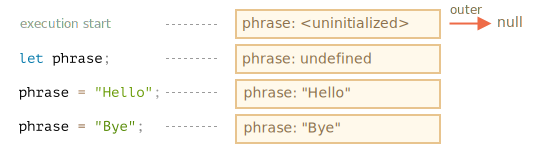
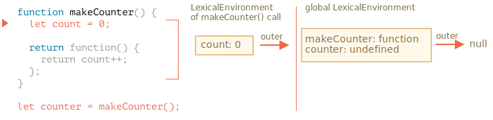

# Variable scope

<<<<<<< HEAD
JavaScript is a very function-oriented language. It gives us a lot of freedom. A function can be created at one moment, then copied to another variable or passed as an argument to another function and called from a totally different place later.

We know that a function can access variables outside of it; this feature is used quite often.
=======
JavaScript is a very function-oriented language. It gives us a lot of freedom. A function can be created dynamically, passed as an argument to another function and called from a totally different place of code later.

We already know that a function can access variables outside of it.
>>>>>>> fcfef6a07842ed56144e04a80c3a24de049a952a

Now let's expand our knowledge to include more complex scenarios.

```smart header="We'll talk about `let/const` variables here"
In JavaScript, there are 3 ways to declare a variable: `let`, `const` (the modern ones), and `var` (the remnant of the past).

<<<<<<< HEAD
Different languages behave differently here, and in this chapter we cover the behaviour of JavaScript.

## A couple of questions

Let's consider two situations to begin with, and then study the internal mechanics piece-by-piece, so that you'll be able to answer the following questions and more complex ones in the future.

1. The function `sayHi` uses an external variable `name`. When the function runs, which value is it going to use?

    ```js
    let name = "John";

    function sayHi() {
      alert("Hi, " + name);
    }

    name = "Pete";

    *!*
    sayHi(); // what will it show: "John" or "Pete"?
    */!*
    ```

    Such situations are common both in browser and server-side development. A function may be scheduled to execute later than it is created, for instance after a user action or a network request.

    So, the question is: does it pick up the latest changes?


2. The function `makeWorker` makes another function and returns it. That new function can be called from somewhere else. Will it have access to the outer variables from its creation place, or the invocation place, or both?

    ```js
    function makeWorker() {
      let name = "Pete";

      return function() {
        alert(name);
      };
    }

    let name = "John";

    // create a function
    let work = makeWorker();

    // call it
    *!*
    work(); // what will it show? "Pete" (name where created) or "John" (name where called)?
    */!*
    ```


## Lexical Environment

To understand what's going on, let's first discuss what a "variable" actually is.

In JavaScript, every running function, code block, and the script as a whole have an associated object known as the *Lexical Environment*.

The Lexical Environment object consists of two parts:

1. *Environment Record* -- an object that has all local variables as its properties (and some other information like the value of `this`).
2. A reference to the *outer lexical environment*, usually the one associated with the code lexically right outside of it (outside of the current curly brackets).

**So, a "variable" is just a property of the special internal object, Environment Record. "To get or change a variable" means "to get or change a property of that object".**

For instance, in this simple code, there is only one Lexical Environment:


This is a so-called global Lexical Environment, associated with the whole script. For browsers, all `<script>` tags share the same global environment.

On the picture above, the rectangle means Environment Record (variable store) and the arrow means the outer reference. The global Lexical Environment has no outer reference, so it points to `null`.

Here's the bigger picture of how `let` variables work:


Rectangles on the right-hand side demonstrate how the global Lexical Environment changes during the execution:

1. When the script starts, the Lexical Environment is empty.
2. The `let phrase` definition appears. It has been assigned no value, so `undefined` is stored.
3. `phrase` is assigned a value.
4. `phrase` refers to a new value.

Everything looks simple for now, right?

To summarize:

- A variable is a property of a special internal object, associated with the currently executing block/function/script.
- Working with variables is actually working with the properties of that object.

### Function Declaration

Till now, we only observed variables. Now enter Function Declarations.

**Unlike `let` variables, they are fully initialized not when the execution reaches them, but earlier, when a Lexical Environment is created.**

For top-level functions, it means the moment when the script is started.

That is why we can call a function declaration before it is defined.

The code below demonstrates that the Lexical Environment is non-empty from the beginning. It has `say`, because that's a Function Declaration. And later it gets `phrase`, declared with `let`:


### Inner and outer Lexical Environment

Now let's go on and explore what happens when a function accesses an outer variable.

During the call, `say()` uses the outer variable `phrase`, let's look at the details of what's going on.

First, when a function runs, a new function Lexical Environment is created automatically. That's a general rule for all functions. That Lexical Environment is used to store local variables and parameters of the call.

For instance, for `say("John")`, it looks like this (the execution is at the line, labelled with an arrow):

<!--
    ```js
    let phrase = "Hello";

    function say(name) {
     alert( `${phrase}, ${name}` );
    }

    say("John"); // Hello, John
    ```-->


=======
- In this article we'll use `let` variables in examples.
- Variables, declared with `const`, behave the same, so this article is about `const` too.
- The old `var` has some notable differences, they will be covered in the article <info:var>.
```
>>>>>>> fcfef6a07842ed56144e04a80c3a24de049a952a

## Code blocks

If a variable is declared inside a code block `{...}`, it's only visible inside that block.

<<<<<<< HEAD
    It has a single variable: `name`, the function argument. We called `say("John")`, so the value of `name` is `"John"`.
- The outer Lexical Environment is the global Lexical Environment.

    It has `phrase` and the function itself.

The inner Lexical Environment has a reference to the outer one.

**When the code wants to access a variable -- the inner Lexical Environment is searched first, then the outer one, then the more outer one and so on until the end of the chain.**

If a variable is not found anywhere, that's an error in strict mode. Without `use strict`, an assignment to an undefined variable creates a new global variable, for backwards compatibility.
=======
For example:

```js run
{
  // do some job with local variables that should not be seen outside

  let message = "Hello"; // only visible in this block

  alert(message); // Hello
}

alert(message); // Error: message is not defined
```
>>>>>>> fcfef6a07842ed56144e04a80c3a24de049a952a

We can use this to isolate a piece of code that does its own task, with variables that only belong to it:

```js run
{
  // show message
  let message = "Hello";
  alert(message);
}

{
  // show another message
  let message = "Goodbye";
  alert(message);
}
```

````smart header="There'd be an error without blocks"
Please note, without separate blocks there would be an error, if we use `let` with the existing variable name:

<<<<<<< HEAD
**A function gets outer variables as they are now; it uses the most recent values.**

That's because of the described mechanism. Old variable values are not saved anywhere. When a function wants them, it takes the current values from its own or an outer Lexical Environment.
=======
```js run
// show message
let message = "Hello";
alert(message);

// show another message
*!*
let message = "Goodbye"; // Error: variable already declared
*/!*
alert(message);
```
````
>>>>>>> fcfef6a07842ed56144e04a80c3a24de049a952a

For `if`, `for`, `while` and so on, variables declared in `{...}` are also only visible inside:

```js run
if (true) {
  let phrase = "Hello!";

  alert(phrase); // Hello!
}

alert(phrase); // Error, no such variable!
```

Here, after `if` finishes, the `alert` below won't see the `phrase`, hence the error.

That's great, as it allows us to create block-local variables, specific to an `if` branch.

The similar thing holds true for `for` and `while` loops:

```js run
for (let i = 0; i < 3; i++) {
  // the variable i is only visible inside this for
  alert(i); // 0, then 1, then 2
}

<<<<<<< HEAD
```smart header="One call -- one Lexical Environment"
Please note that a new function Lexical Environment is created each time a function runs.

And if a function is called multiple times, then each invocation will have its own Lexical Environment, with local variables and parameters specific for that very run.
```

```smart header="Lexical Environment is a specification object"
"Lexical Environment" is a specification object. We can't get this object in our code and manipulate it directly. JavaScript engines also may optimize it, discard variables that are unused to save memory and perform other internal tricks, but the visible behavior should be as described.
=======
alert(i); // Error, no such variable
>>>>>>> fcfef6a07842ed56144e04a80c3a24de049a952a
```

Visually, `let i` is outside of `{...}`. But the `for` construct is special here: the variable, declared inside it, is considered a part of the block.

## Nested functions

A function is called "nested" when it is created inside another function.

It is easily possible to do this with JavaScript.

We can use it to organize our code, like this:

```js
function sayHiBye(firstName, lastName) {

  // helper nested function to use below
  function getFullName() {
    return firstName + " " + lastName;
  }

  alert( "Hello, " + getFullName() );
  alert( "Bye, " + getFullName() );

}
```

Here the *nested* function `getFullName()` is made for convenience. It can access the outer variables and so can return the full name. Nested functions are quite common in JavaScript.

What's much more interesting, a nested function can be returned: either as a property of a new object or as a result by itself. It can then be used somewhere else. No matter where, it still has access to the same outer variables.

Below, `makeCounter` creates the "counter" function that returns the next number on each invocation:

```js run
function makeCounter() {
  let count = 0;

  return function() {
<<<<<<< HEAD
    return count++; // has access to the outer counter
=======
    return count++;
>>>>>>> fcfef6a07842ed56144e04a80c3a24de049a952a
  };
}

let counter = makeCounter();

alert( counter() ); // 0
alert( counter() ); // 1
alert( counter() ); // 2
```

Despite being simple, slightly modified variants of that code have practical uses, for instance, as a [random number generator](https://en.wikipedia.org/wiki/Pseudorandom_number_generator) to generate random values for automated tests.

How does this work? If we create multiple counters, will they be independent? What's going on with the variables here?

Undestanding such things is great for the overall knowledge of JavaScript and beneficial for more complex scenarios. So let's go a bit in-depth.

## Lexical Environment

```warn header="Here be dragons!"
The in-depth technical explanation lies ahead.

As far as I'd like to avoid low-level language details, any understanding without them would be lacking and incomplete, so get ready.
```

For clarity, the explanation is split into multiple steps.

<<<<<<< HEAD
Hopefully, the situation with outer variables is quite clear for you now. But in more complex situations a deeper understanding of internals may be required. So let's dive deeper.

## Environments in detail

Now that you understand how closures work generally, that's already very good.

Here's what's going on in the `makeCounter` example step-by-step, follow it to make sure that you know things in the very detail.

Please note the additional `[[Environment]]` property is covered here. We didn't mention it before for simplicity.

1. When the script has just started, there is only global Lexical Environment:

    

    At that starting moment there is only `makeCounter` function, because it's a Function Declaration. It did not run yet.

    **All functions "on birth" receive a hidden property `[[Environment]]` with a reference to the Lexical Environment of their creation.** We didn't talk about it yet, but that's how the function knows where it was made.

    Here, `makeCounter` is created in the global Lexical Environment, so `[[Environment]]` keeps a reference to it.

    In other words, a function is "imprinted" with a reference to the Lexical Environment where it was born. And `[[Environment]]` is the hidden function property that has that reference.

2. The code runs on, the new global variable `counter` is declared and for its value `makeCounter()` is called. Here's a snapshot of the moment when the execution is on the first line inside `makeCounter()`:

    

    At the moment of the call of `makeCounter()`, the Lexical Environment is created, to hold its variables and arguments.

    As all Lexical Environments, it stores two things:
    1. An Environment Record with local variables. In our case `count` is the only local variable (appearing when the line with `let count` is executed).
    2. The outer lexical reference, which is set to `[[Environment]]` of the function. Here `[[Environment]]` of `makeCounter` references the global Lexical Environment.

    So, now we have two Lexical Environments: the first one is global, the second one is for the current `makeCounter` call, with the outer reference to global.

3. During the execution of `makeCounter()`, a tiny nested function is created.

    It doesn't matter whether the function is created using Function Declaration or Function Expression. All functions get the `[[Environment]]` property that references the Lexical Environment in which they were made. So our new tiny nested function gets it as well.

    For our new nested function the value of `[[Environment]]` is the current Lexical Environment of `makeCounter()` (where it was born):
=======
### Step 1. Variables

In JavaScript, every running function, code block `{...}`, and the script as a whole have an internal (hidden) associated object known as the *Lexical Environment*.
>>>>>>> fcfef6a07842ed56144e04a80c3a24de049a952a

The Lexical Environment object consists of two parts:

<<<<<<< HEAD
    Please note that on this step the inner function was created, but not yet called. The code inside `function() { return count++; }` is not running; we're going to return it soon.
=======
1. *Environment Record* -- an object that stores all local variables as its properties (and some other information like the value of `this`).
2. A reference to the *outer lexical environment*, the one associated with the outer code.
>>>>>>> fcfef6a07842ed56144e04a80c3a24de049a952a

**A "variable" is just a property of the special internal object, `Environment Record`. "To get or change a variable" means "to get or change a property of that object".**

In this simple code without functions, there is only one Lexical Environment:


<<<<<<< HEAD
5. When the `counter()` is called, an "empty" Lexical Environment is created for it. It has no local variables by itself. But the `[[Environment]]` of `counter` is used as the outer reference for it, so it has access to the variables of the former `makeCounter()` call where it was created:
=======
This is the so-called *global* Lexical Environment, associated with the whole script.
>>>>>>> fcfef6a07842ed56144e04a80c3a24de049a952a

On the picture above, the rectangle means Environment Record (variable store) and the arrow means the outer reference. The global Lexical Environment has no outer reference, that's why the arrow points to `null`.

<<<<<<< HEAD
    Now if it accesses a variable, it first searches its own Lexical Environment (empty), then the Lexical Environment of the former `makeCounter()` call, then the global one.

    When it looks for `count`, it finds it among the variables `makeCounter`, in the nearest outer Lexical Environment.
=======
As the code starts executing and goes on, the Lexical Environment changes.
>>>>>>> fcfef6a07842ed56144e04a80c3a24de049a952a

Here's a little bit longer code:



Rectangles on the right-hand side demonstrate how the global Lexical Environment changes during the execution:

1. When the script starts, the Lexical Environment is pre-populated with all declared variables.
    - Initially, they are in the "Uninitialized" state. That's a special internal state, it means that the engine knows about the variable, but won't allow to use it before `let`. It's almost the same as if the variable didn't exist.
2. Then `let phrase` definition appears. There's no assignment yet, so its value is `undefined`. We can use the variable since this moment.
3. `phrase` is assigned a value.
4. `phrase` changes the value.

<<<<<<< HEAD
    So we return to the previous step with the only change -- the new value of `count`. The following calls all do the same.

7. Next `counter()` invocations do the same.
=======
Everything looks simple for now, right?
>>>>>>> fcfef6a07842ed56144e04a80c3a24de049a952a

- A variable is a property of a special internal object, associated with the currently executing block/function/script.
- Working with variables is actually working with the properties of that object.

<<<<<<< HEAD
The `work()` function in the code below uses the `name` from the place of its origin through the outer lexical environment reference:
=======
```smart header="Lexical Environment is a specification object"
"Lexical Environment" is a specification object: it only exists "theoretically" in the [language specification](https://tc39.es/ecma262/#sec-lexical-environments) to describe how things work. We can't get this object in our code and manipulate it directly.
>>>>>>> fcfef6a07842ed56144e04a80c3a24de049a952a

JavaScript engines also may optimize it, discard variables that are unused to save memory and perform other internal tricks, as long as the visible behavior remains as described.
```

### Step 2. Function Declarations

A function is also a value, like a variable.

**The difference is that a Function Declaration is instantly fully initialized.**

When a Lexical Environment is created, a Function Declaration immediately becomes a ready-to-use function (unlike `let`, that is unusable till the declaration).

That's why we can use a function, declared as Function Declaration, even before the declaration itself.

For example, here's the initial state of the global Lexical Environment when we add a function:


Naturally, this behavior only applies to Function Declarations, not Function Expressions where we assign a function to a variable, such as `let say = function(name)...`.

### Step 3. Inner and outer Lexical Environment

When a function runs, at the beginning of the call, a new Lexical Environment is created automatically to store local variables and parameters of the call.

For instance, for `say("John")`, it looks like this (the execution is at the line, labelled with an arrow):

<!--
    ```js
    let phrase = "Hello";

    function say(name) {
     alert( `${phrase}, ${name}` );
    }

    say("John"); // Hello, John
    ```-->


During the function call we have two Lexical Environments: the inner one (for the function call) and the outer one (global):

- The inner Lexical Environment corresponds to the current execution of `say`. It has a single property: `name`, the function argument. We called `say("John")`, so the value of the `name` is `"John"`.
- The outer Lexical Environment is the global Lexical Environment. It has the `phrase` variable and the function itself.

<<<<<<< HEAD
For a loop, every iteration has a separate Lexical Environment. If a variable is declared in `for`, then it's also local to that Lexical Environment:

```js run
for (let i = 0; i < 10; i++) {
  // Each loop has its own Lexical Environment
  // {i: value}
}

alert(i); // Error, no such variable
```

Please note: `let i` is visually outside of `{...}`. The `for` construct is somewhat special here: each iteration of the loop has its own Lexical Environment with the current `i` in it.
=======
The inner Lexical Environment has a reference to the `outer` one.

**When the code wants to access a variable -- the inner Lexical Environment is searched first, then the outer one, then the more outer one and so on until the global one.**
>>>>>>> fcfef6a07842ed56144e04a80c3a24de049a952a

If a variable is not found anywhere, that's an error in strict mode (without `use strict`, an assignment to a non-existing variable creates a new global variable, for compatibility with old code).

In this example the search proceeds as follows:

- For the `name` variable, the `alert` inside `say` finds it immediately in the inner Lexical Environment.
- When it wants to access `phrase`, then there is no `phrase` locally, so it follows the reference to the outer Lexical Environment and finds it there.

<<<<<<< HEAD
For instance, in a web browser all scripts share the same global area. So if we create a global variable in one script, it becomes available to others. But that becomes a source of conflicts if two scripts use the same variable name and overwrite each other.
=======

>>>>>>> fcfef6a07842ed56144e04a80c3a24de049a952a


### Step 4. Returning a function

Let's return to the `makeCounter` example.

```js
function makeCounter() {
  let count = 0;

  return function() {
    return count++;
  };
}

let counter = makeCounter();
```

At the beginning of each `makeCounter()` call, a new Lexical Environment object is created, to store variables for this `makeCounter` run.

So we have two nested Lexical Environments, just like in the example above:



What's different is that, during the execution of `makeCounter()`, a tiny nested function is created of only one line: `return count++`. We don't run it yet, only create.

All functions remember the Lexical Environment in which they were made. Technically, there's no magic here: all functions have the hidden property named `[[Environment]]`, that keeps the reference to the Lexical Environment where the function was created:


So, `counter.[[Environment]]` has the reference to `{count: 0}` Lexical Environment. That's how the function remembers where it was created, no matter where it's called. The `[[Environment]]` reference is set once and forever at function creation time.

Later, when `counter()` is called, a new Lexical Environment is created for the call, and its outer Lexical Environment reference is taken from `counter.[[Environment]]`:


Now when the code inside `counter()` looks for `count` variable, it first searches its own Lexical Environment (empty, as there are no local variables there), then the Lexical Environment of the outer `makeCounter()` call, where finds it and changes.

**A variable is updated in the Lexical Environment where it lives.**

Here's the state after the execution:


If we call `counter()` multiple times, the `count` variable will be increased to `2`, `3` and so on, at the same place.

```smart header="Closure"
There is a general programming term "closure", that developers generally should know.

A [closure](https://en.wikipedia.org/wiki/Closure_(computer_programming)) is a function that remembers its outer variables and can access them. In some languages, that's not possible, or a function should be written in a special way to make it happen. But as explained above, in JavaScript, all functions are naturally closures (there is only one exception, to be covered in <info:new-function>).

That is: they automatically remember where they were created using a hidden `[[Environment]]` property, and then their code can access outer variables.

When on an interview, a frontend developer gets a question about "what's a closure?", a valid answer would be a definition of the closure and an explanation that all functions in JavaScript are closures, and maybe a few more words about technical details: the `[[Environment]]` property and how Lexical Environments work.
```

<<<<<<< HEAD
In all the above cases we declare a Function Expression and run it immediately.

=======
>>>>>>> fcfef6a07842ed56144e04a80c3a24de049a952a
## Garbage collection

Usually, a Lexical Environment is removed from memory with all the variables after the function call finishes. That's because there are no references to it. As any JavaScript object, it's only kept in memory while it's reachable.

...But if there's a nested function that is still reachable after the end of a function, then it has `[[Environment]]` property that references the lexical environment.

In that case the Lexical Environment is still reachable even after the completion of the function, so it stays alive.

<<<<<<< HEAD
...But if there's a nested function that is still reachable after the end of `f`, then its `[[Environment]]` reference keeps the outer lexical environment alive as well:
=======
For example:
>>>>>>> fcfef6a07842ed56144e04a80c3a24de049a952a

```js
function f() {
  let value = 123;

  return function() {
    alert(value);
  }
}

let g = f(); // g.[[Environment]] stores a reference to the Lexical Environment
// of the corresponding f() call
```

Please note that if `f()` is called many times, and resulting functions are saved, then the corresponding Lexical Environment objects will also be retained in memory. All 3 of them in the code below:

```js
function f() {
  let value = Math.random();

  return function() { alert(value); };
}

// 3 functions in array, every one of them links to Lexical Environment
// from the corresponding f() run
//         LE   LE   LE
let arr = [f(), f(), f()];
```

A Lexical Environment object dies when it becomes unreachable (just like any other object). In other words, it exists only while there's at least one nested function referencing it.

In the code below, after the nested function is removed, its enclosing Lexical Environment (and hence the `value`) is cleaned from memory:

```js
function f() {
  let value = 123;

  return function() {
    alert(value);
  }
}

<<<<<<< HEAD
let g = f(); // while g is alive
// there corresponding Lexical Environment lives
=======
let g = f(); // while g function exists, the value stays in memory
>>>>>>> fcfef6a07842ed56144e04a80c3a24de049a952a

g = null; // ...and now the memory is cleaned up
```

### Real-life optimizations

As we've seen, in theory while a function is alive, all outer variables are also retained.

But in practice, JavaScript engines try to optimize that. They analyze variable usage and if it's easy to see that an outer variable is not used -- it is removed.

**An important side effect in V8 (Chrome, Opera) is that such variable will become unavailable in debugging.**

Try running the example below in Chrome with the Developer Tools open.

When it pauses, in the console type `alert(value)`.

```js run
function f() {
  let value = Math.random();

  function g() {
    debugger; // in console: type alert( value ); No such variable!
  }

  return g;
}

let g = f();
g();
```

As you could see -- there is no such variable! In theory, it should be accessible, but the engine optimized it out.

That may lead to funny (if not such time-consuming) debugging issues. One of them -- we can see a same-named outer variable instead of the expected one:

```js run global
let value = "Surprise!";

function f() {
  let value = "the closest value";

  function g() {
    debugger; // in console: type alert( value ); Surprise!
  }

  return g;
}

let g = f();
g();
```

This feature of V8 is good to know. If you are debugging with Chrome/Opera, sooner or later you will meet it.

That is not a bug in the debugger, but rather a special feature of V8. Perhaps it will be changed sometime. You always can check for it by running the examples on this page.
