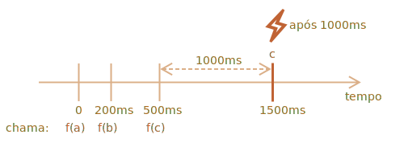

importance: 5

---

# O Decorador Debounce

O resultado do decorador `debounce(f, ms)` é um encapsulador que suspende chamadas para `f` até haver `ms` milissegundos de inactividade (sem chamadas, "período de espera"), depois invoca `f` uma vez com os últimos argumentos.

Em outras palavras, `debounce` é como uma secretária que aceita "chamadas de telefones", e espera até existir `ms` milissegundos de espera. E somente então transferir as últimas informações de chamadas para "o chefe" (chama a `f` atual).

Por exemplo, tinhamos uma função `f` e a substituimos com `f = debounce(f, 1000)`.

Então se a função encapsulada é chamada aos 0ms, 200ms, e 500ms, e depois não houver chamadas, a `f` atual será somente chamada uma vez, aos 1500ms. Ou seja: depois do período de espera de 1000ms da última chamada.



...E receberão os argumentos de toda última chamada, outras chamadas são ignorada.

Aqui estão o código para isto (que usa o decorador debounce da [biblioteca Lodash](https://lodash.com/docs/4.17.15#debounce)):

```js
let f = _.debounce(alert, 1000);

f("a");
setTimeout( () => f("b"), 200);
setTimeout( () => f("c"), 500);
// função tratada pelo debounce espera 1000ms depois da última chamada e depois executa: alert("*")
```

Agora um exemplo prático. Vamos dizer, que usuário digite alguma coisa, e gostariamos enviar uma requisição para o servidor quando a entrada estiver terminda.


Não adianta enviar uma requesição para character digitado. Ao invés disso gostariamos de esperar, e depois processar todo resultado.

Em um web-browser, nós podemos configurar um manipulador de evento -- uma função que é chamada em todas mundanças no campo de entrada. Normalmente, um manipulador de evento é chamado sempre, para toda tecla pressionada. Porém se nós `debounce` ela por 1000ms, logo ela será chamanda apenas uma vez, depois 1000ms depois da última entrada.

```online

Neste exemplo funcionando, o manipulador coloca o resultado dentro da caixa abaixo, experimente:

[iframe border=1 src="debounce" height=200]

Vês? A segunda entrada chama a função na qual foi aplicada o debounce, então o seu conteúdo será processado depois de 1000ms da última entrada.
```

Portanto, `debounce` é excelente maneira de processar uma sequência de eventos: seja ela uma sequência de pressões de teclas, movimentos de mouse ou alguma coisa do genero.

Isto espera o tempo dado depois da última chamada, e depois executa sua função, que pode processar o resultado.

A tarefa está em implementar o decorador `debounce`.

Dica: são apenas uma poucas linhas se você pensar sobre ela :)