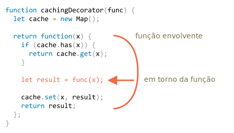

# Decoradores e reencaminhamento, chamar/aplicar

A JavaScript oferece uma flexibilidade excecional ao lidar com funções. Podem ser transmitidas, utilizadas como objetos, e agora veremos como *encaminhar* chamadas entre elas e *decorá-las*.

## Memorização transparente

Digamos que temos uma função `slow(x)` que consume muito processamento, mas seus resultados são estáveis. Em outras palavras, para o mesmo `x` esta sempre retorna o mesmo resultado.

Se a função for chamada com frequência, podemos querer memorizar (lembrar) os resultados para evitar gastar tempo adicional em recálculos.

Mas, em vez de adicionar essa funcionalidade em `slow()` criaremos uma função de embrulho, que adiciona a memorização. Como veremos, existem muitas vantagens em fazê-lo.

Eis o código, e as explicações que se seguem:

```js run
function slow(x) {
  // pode haver um processamento intensivo aqui
  alert(`Called with ${x}`);
  return x;
}

function cachingDecorator(func) {
  let cache = new Map();

  return function(x) {
    if (cache.has(x)) {    // se existir tal chave na memória
      return cache.get(x); // ler o resultado do mesmo
    }

    let result = func(x);  // caso contrário, chamar função

    cache.set(x, result);  // e memorizar (lembrar) o resultado
    
    return result;
  };
}

slow = cachingDecorator(slow);

alert( slow(1) ); // slow(1) é memorizado e o resultado retornado
alert( "Again: " + slow(1) ); // resultado da slow(1) retornado da memória

alert( slow(2) ); // slow(2) é memorizado e o resultado retornado
alert( "Again: " + slow(2) ); // resultado da slow(2) retornado da memória
```

No código acima `cachingDecorator` é um *decorador*: uma função especial que pega em outra função e altera o seu comportamento.

A ideia é que podemos chamar `cachingDecorator` para qualquer função, e esta retornará o embrulho de memorização. Isto é ótimo, porque podemos ter muitas funções que poderiam usar esse recurso, e tudo o que precisamos fazer é aplicar `cachingDecorator` a elas.

Ao separar a memorização do código da função principal, também mantemos o código principal mais simples.

O resultado de `caching` é um "embrulho": `function(x)` que "embrulha" a chama da `func(x)` na lógica de memorização:



A partir dum código externo, a função `slow` embrulhada ainda faz o mesmo. Esta apenas tem um aspeto de memorização adicionado ao seu comportamento.

Para resumir, existem vários benefícios em utilizar um `cachingDecorator` separado ao invés de alterar o código da `slow` em si:

- O `cachingDecorator` é reutilizável. Podemos aplicá-lo a outra função.
- A lógica de memorização é separada, não aumentou a complexidade da `slow` em si (se é que existia alguma).
- Podemos combinar vários decoradores, se necessário (outros decoradores seguir-se-ão).

## Usando  `func.call` para o contexto

O decorador de memorização mencionado acima não é adequado para trabalhar com o métodos de objeto.

Por exemplo, no código abaixo `worker.slow()` para de funcionar após a decoração:

```js run
// faremos a memorização do `worker.slow`
let worker = {
  someMethod() {
    return 1;
  },

  slow(x) {
    // tarefa de processamento
    // assustadoramente pesado.
    alert("Called with " + x);
    return x * this.someMethod(); // (*)
  }
};

// o mesmo código que o anterior
function cachingDecorator(func) {
  let cache = new Map();
  return function(x) {
    if (cache.has(x)) {
      return cache.get(x);
    }
*!*
    let result = func(x); // (**)
*/!*
    cache.set(x, result);
    return result;
  };
}

alert( worker.slow(1) ); // o método original funciona

worker.slow = cachingDecorator(worker.slow); // agora, memorize-o

*!*
alert( worker.slow(2) ); // Ups! Erro: Não é possível ler a 'someMethod' de indefinido
*/!*
```

O erro ocorre na linha `(*)` que tenta acessar a `this.someMethod` e falha. Podemos ver por quê?

A razão é que o embrulhador chama a função original como `func(x)` na linha `(**)`. E, quando chamada desta maneira, a função recebe `this = undefined`.

Observaríamos um sintoma semelhante se tentássemos executar:

```js
let func = worker.slow;
func(2);
```

Assim, o embrulhador passa a chamada para o método original, mas sem o contexto `this`. Daí o erro.

Vamos corrigi-lo.

Existe uma método especial de função embutido [`func.call(context, ...args)`](mdn:js/Function/call) que permite chamar uma função definindo explicitamente `this`.

A sintaxe é:

```js
func.call(context, arg1, arg2, ...)
```

Ele executa `func` fornecendo o primeiro argumento como `this`, e o próximo como os argumentos.

Para simplificar, estas duas chamadas fazem quase o mesmo:

```js
func(1, 2, 3);
func.call(obj, 1, 2, 3)
```

Ambas chamam `func` com os argumentos `1`, `2`, e `3`. A única diferença é que `func.call` também define `this` como `obj`.

Como exemplo, no código abaixo chamamos `sayHi` no contexto de diferentes objetos: `sayHi.call(user)` executa `sayHi` fornecendo `this=user`, e a próxima linha define `this=admin`:

```js run
function sayHi() {
  alert(this.name);
}

let user = { name: "John" };
let admin = { name: "Admin" };

// usar `call` para passar
// diferentes objetos como "this"
sayHi.call( user ); // John
sayHi.call( admin ); // Admin
```

E aqui usamos `call` para chamar `say` com o dado contexto e frase:

```js run
function say(phrase) {
  alert(this.name + ': ' + phrase);
}

let user = { name: "John" };

// `user` torna-se `this`, e "Hello"
// torna-se o primeiro argumento
say.call( user, "Hello" ); // John: Hello
```

No nosso caso, podemos usar `call` no embrulhador para passar o contexto para a função original:

```js run
let worker = {
  someMethod() {
    return 1;
  },

  slow(x) {
    alert("Called with " + x);
    return x * this.someMethod(); // (*)
  }
};

function cachingDecorator(func) {
  let cache = new Map();
  return function(x) {
    if (cache.has(x)) {
      return cache.get(x);
    }
*!*
    let result = func.call(this, x); // "this" é agora passado corretamente
*/!*
    cache.set(x, result);
    return result;
  };
}

worker.slow = cachingDecorator(worker.slow); // agora, memoriza-o

alert( worker.slow(2) ); // funciona
alert( worker.slow(2) ); // funciona, não chama o original (memorizado)
```

Agora está tudo bem.

Para tornar tudo mais claro, veremos mais profundamente como `this` é passado adiante:

1. Após a decoração, `worker.slow` agora é o embrulhador `function (x) { ... }`.
2. Então quando `worker.slow(2)` é executado, o embrulhador recebe `2` como argumento e `this=worker` (é o objeto antes do ponto).
3. Dentro do embrulhador, assumindo que o resultado ainda não está memorizado, `func.call(this, x)` passa o `this` atual (`=worker`) e o argumento atual (`=2`) para o método original.

## Passando vários argumentos

Agora vamos tornar o `cachingDecorator` ainda mais universal. Até agora este estava trabalhando apenas com funções de um único argumento.

Agora, como memorizar o método `worker.slow` com vários argumentos?

```js
let worker = {
  slow(min, max) {
    return min + max; // assume-se que é assustadoramente devoradora de processamento
  }
};

// deve lembrar-se das chamadas com o mesmo argumento
worker.slow = cachingDecorator(worker.slow);
```

Anteriormente, para um único argumento, `x` poderíamos simplesmente `cache.set(x, result)` para guardar o resultado e `cache.get(x)` para recuperá-lo. Mas agora precisamos lembrar o resultado para uma *combinação de argumentos* `(min,max)`. O `Map` nativo recebe apenas um único valor como chave.

Existem muitas soluções possíveis:

1. Implementar uma nova estrutura de dados parecida com o mapa (ou usar uma estrutura de terceiros) que seja mais versátil e permita várias chaves.
2. Usar mapas aninhados: `cache.set(min)` será um `Map` que armazena o par `(max, result)`. Assim, podemos obter o `result` como `cache.get(min).get(max)`.
3. Juntar dois valores num só. No nosso caso particular, podemos usar uma sequência de caracteres `min,max` como chave do `Map`. Para maior flexibilidade, podemos permitir fornecer uma *função de baralhamento* para o decorador, que sabe como fazer um valor a partir de muitos.

Para muitas aplicações práticas, a terceira variante é suficientemente boa, pelo que ficaremos por ela.

Também precisamos passar não apenas `x`, mas todos os argumentos na `func.call`. Lembremos que numa `func.call` podemos obter um pseudo-vetor dos seus argumentos como `arguments`, então `func.call(this, x)` deve ser substituído por `func.call(this, ...arguments)`.

Eis um `cachingDecorator` mais poderoso:

```js run
let worker = {
  slow(min, max) {
    alert(`Called with ${min},${max}`);
    return min + max;
  }
};

function cachingDecorator(func, hash) {
  let cache = new Map();
  return function() {
*!*
    let key = hash(arguments); // (*)
*/!*
    if (cache.has(key)) {
      return cache.get(key);
    }

*!*
    let result = func.call(this, ...arguments); // (**)
*/!*

    cache.set(key, result);
    return result;
  };
}

function hash(args) {
  return args[0] + ',' + args[1];
}

worker.slow = cachingDecorator(worker.slow, hash);

alert( worker.slow(3, 5) ); // funciona
alert( "Again " + worker.slow(3, 5) ); // o mesmo (memorizado)
```

Agora funciona com qualquer número de argumentos (embora a função de baralhar também precise de ser ajustada para permitir qualquer número de argumentos. Uma maneira interessante de lidar com isto será abordada mais adiante).

Existem duas alterações:

- Na linha `(*)` chama `hash` para criar uma única chave a partir de `arguments`. Neste caso usamos uma função simples de "junção" que transforma os argumentos `(3,5)` na chave `"3,5"`. Os casos mais complexos podem exigir outras funções de baralhamento.
- Então `(**)` usa `func.call(this, ...arguments)` para passar tanto o contexto quanto todos os argumentos que o embrulhador recebeu (não apenas o primeiro) para a função original.

## `func.apply`

Em vez de `func.call(this, ...arguments)` poderíamos usar `func.apply(this, arguments)`.

A sintaxe do método embutido [`func.apply`](mdn:js/Function/apply) é:

```js
func.apply(context, args)
```

Este executa a `func` definindo `this=context` e usando um objeto parecido com vetor `args` como lista de argumentos.

A única diferença entre `call` e `apply` é que `call` espera uma lista de argumentos, enquanto `apply` recebe um objeto parecido com vetor com eles.

Assim, estas duas chamadas são quase equivalentes:

```js
func.call(context, ...args);
func.apply(context, args);
```

Estas realizam a mesma chama de `func` com dado contexto e argumentos.

Existe apenas uma diferença subtil em relação a `args`:

- A sintaxe de propagação `...` permite passar `args` *iteráveis* como lista a `call`.
- O `apply` aceita apenas `args` *parecidos com vetor*.

...E para objetos que são simultaneamente iteráveis e semelhantes a um vetor, tais como um vetor de verdade, podemos usar qualquer um destes, mas `apply` será provavelmente mais rápido, porque a maioria dos motores de JavaScript otimizam-o internamente melhor.

A passagem de todos os argumentos juntamente com o contexto a outra função chama-se **encaminhamento de chamada**.

Esta é a maneira mais simples de o fazer:

```js
let wrapper = function() {
  return func.apply(this, arguments);
};
```

Quando um código externo chama este `wrapper`, é indistinguível da chamada da função original `func`.

## Emprestando um método [#method-borrowing]

Agora vamos fazer mais uma pequena melhoria na função de baralhamento:

```js
function hash(args) {
  return args[0] + ',' + args[1];
}
```

De momento, funciona apenas com dois argumentos. Seria melhor se pudesse colar qualquer número de `args`.

A solução natural seria usar o método [`arr.join`](mdn:js/Array/join):

```js
function hash(args) {
  return args.join();
}
```

...Infelizmente, isso não funcionará. Porque estamos chamando `hash(arguments)`, e o objeto `arguments` é tanto iterável quanto semelhante a um vetor, mas não um vetor de verdade.

Por isso, chamar `join` sobre este falharia, como podemos ver abaixo:

```js run
function hash() {
*!*
  alert( arguments.join() ); // Error: `arguments.join` não é uma função
*/!*
}

hash(1, 2);
```

No entanto, existe uma maneira fácil de usar a junção de vetor:

```js run
function hash() {
*!*
  alert( [].join.call(arguments) ); // 1,2
*/!*
}

hash(1, 2);
```

O truque chama-se *empréstimo de método*.

Nós pegamos (emprestamos) um método de junção dum vetor normal (`[].join`) e usamos `[].join.call()` para executá-lo no contexto de `arguments`.

Por que é que funciona?

Isto acontece porque o algoritmo interno do método nativo `arr.join(glue)` é muito simples.

Retirado da especificação quase "tal e qual":

1. Deixar `glue` ser o primeiro argumento, ou se não existirem argumentos, então uma vírgula `","`.
2. Deixar `result` ser uma sequência de caracteres vazia.
3. Anexar `this[0]` ao `result`.
4. Anexar `glue` e `this[1]`.
5. Anexar `glue` e `this[2]`.
6. ...Fazer isto até que itens de `this.length` estejam colados.
7. Retornar `result`.

Então, tecnicamente este recebe `this` e junta `this[0]`, `this[1]` ...etc. Foi intencionalmente escrito de maneira a permitir qualquer `this` parecido com vetor (não por coincidência, muitos métodos seguem essa prática). É por isto que este também funciona com `this=arguments`.

## Decoradores e propriedades de função

É geralmente seguro substituir uma função ou um método por um decorado, exceto por uma pequena coisa. Se a função original tinha propriedades, como `func.calledCount` ou qualquer outra, então a função decorada não as fornecerá. Porque isso é um embrulhador. Portanto, é preciso ter cuidado ao usá-las.

Por exemplo, no exemplo acima se a função `slow` tivesse algum propriedade, então `cachingDecorator(slow)` é um embrulhador sem estas.

Alguns decoradores podem fornecer as suas propriedades. Por exemplo, um decorador pode contar quantas vezes uma função foi invocada e quanto tempo demorou, e expor esta informação através das propriedades do embrulhador.

Existe uma maneira de criar decoradores que preservam o acesso às propriedades das funções, mas isso exige usar um objeto `Proxy` especial para embrulhar uma função. Nós discutiremos isso mais tarde no artigo <info:proxy#proxy-apply>.

## Sumário

O *decorador* é um embrulhador em torno duma função que altera o seu comportamento. O trabalho principal continua a ser efetuado pela função.

Os decoradores podem ser vistos como "características" ou "aspetos" que podem ser adicionados a uma função. Nós podemos adicionar um ou mais. E tudo isto sem alterar o seu código!

Para implementar `cachingDecorator`, estudámos os métodos:

- [`func.call(context, arg1, arg2...)`](mdn:js/Function/call) — chama `func` com o contexto e argumentos fornecidos.
- [`func.apply(context, args)`](mdn:js/Function/apply) — chama `func` passando `context` como `this` e `args` parecido com vetor numa lista de argumentos.

O *encaminhamento de chamada* genérico é normalmente efetuado com `apply`:

```js
let wrapper = function() {
  return original.apply(this, arguments);
};
```

Também vimos um exemplo de **empréstimo de método** quando pegamos um método dum objeto e o chamamos no contexto de outro objeto. É muito comum pegar em métodos de vetor e aplicá-los a `arguments`. A alternativa é usar o objeto de parâmetros restantes que é um vetor de verdade.

Existem muitos decoradores à disposição. Nós podemos verificar se os conseguimos entender resolvendo as tarefas deste capítulo.
