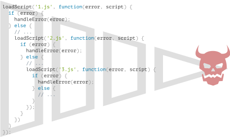

# Introdução: callbacks

```warn header="Nós usamos métodos do navegador aqui nos exemplos"
Para demonstrar o uso de callbacks, promises e outros conceitos abstratos, nós vamos usar alguns métodos do navegador: especificamente, carregar scripts e fazer manipulações simples de documentos.

Se você não está familiarizado com esses métodos, e o uso deles nos exemplos parece confuso, pode ser que você queira ler alguns capítulos da [próxima parte](/document) do tutorial.

Mas nós vamos tentar deixar as coisas claras de qualquer jeito. Não vai ter nada muito complexo em relação ao navegador.
```

Muitas funções providas pelo JavaScript permitem que você agende ações *assíncronas*. Em outras palavras, ações que nós iniciamos agora, mas elas terminam mais tarde.

Por exemplo, uma dessas funções é a função `setTimeout`.

Existem outros exemplos práticos de ações assíncronas, por exemplo: carregar scripts e módulos (nós vamos ver nos capítulos adiante).

Veja a função `loadScript(src)`, que carrega um script com um dado `src`:

```js
function loadScript(src) {
  // creates a <script> tag and append it to the page
  // this causes the script with given src to start loading and run when complete
  let script = document.createElement('script');
  script.src = src;
  document.head.append(script);
}
```

Ela acrescenta ao documento a nova, dinamicamente criada, tag `<script src="…">` com o `src` passado. O navegador começa a carregar ele automaticamente e o executa quando terminar.

Podemos usar essa função assim:

```js
// carrega e executa o script no caminho dado
loadScript('/my/script.js');
```

O script é executado "assincronamente", porque ele começa a carregar agora, mas executa mais tarde, quando a função já terminou.

Se tiver algum código abaixo de `loadScript(…)`, ele não espera até que o script termine de carregar.

```js
loadScript('/my/script.js');
// o código embaixo de loadScript não espera o carregamento do script terminar
// ...
```

Agora, vamos imaginar que queremos usar o novo script assim que ele terminar de carregar. Ele provavelmente declara novas funções, e queremos executar elas.

Mas se nós fizermos isso imediatamente depois da chamada `loadScript(…)`, não iria funcionar.

```js
loadScript('/my/script.js'); // o script tem "function newFunction() {…}"

*!*
newFunction(); // a função não existe!
*/!*
```

Naturalmente, o navegador provavelmente não teve tempo de carregar o script. Então a chamada imediata para a nova função falha. Do jeito que está, a função `loadScript` não provê uma maneira de saber quando o carregamento termina. O script carrega e eventualmente é executado, isso é tudo. Mas nós queremos saber quando isso acontece, para podermos usar as novas funções e variáveis daquele script.

Vamos adicionar uma função `callback` como segundo argumento em `loadScript` que deve executar quando o script terminar de carregar:

```js
function loadScript(src, *!*callback*/!*) {
  let script = document.createElement('script');
  script.src = src;

*!*
  script.onload = () => callback(script);
*/!*

  document.head.append(script);
}
```

Agora se nós quisermos chamar as novas funções do script, nós podemos fazer isso no callback:

```js
loadScript('/my/script.js', function() {
  // o callback executa depois que o script termina de carregar
  newFunction(); // então agora funciona
  ...
});
```

Esta é a ideia: o segundo argumento é uma função (normalmente anônima) que executa quando a ação termina.

Veja um exemplo executável com um script real:

```js run
function loadScript(src, callback) {
  let script = document.createElement('script');
  script.src = src;
  script.onload = () => callback(script);
  document.head.append(script);
}

*!*
loadScript('https://cdnjs.cloudflare.com/ajax/libs/lodash.js/3.2.0/lodash.js', script => {
  alert(`Legal, o script ${script.src} está carregado`);
  alert( _ ); // função declarada no script carregado
});
*/!*
```

Isso é chamado de programação assíncrona "baseada em callbacks". A função que faz alguma coisa assincronamente deve prover um argumento `callback` onde nós colocamos a função que vai executar depois que ela terminar.

Aqui nós fizemos isso em `loadScript`, mas é claro que isso é uma abordagem genérica.

## Callback no callback

Como poderíamos carregar dois scripts sequencialmente? Carregar um primeiro, e depois o segundo?

A solução natural seria colocar a segunda chamada de `loadScript` dentro do callback, assim:

```js
loadScript('/my/script.js', function(script) {

  alert(`Legal, ${script.src} foi carregado, vamos carregar mais um`);

*!*
  loadScript('/my/script2.js', function(script) {
    alert(`Legal, o segundo script foi carregado`);
  });
*/!*

});
```

Depois que o `loadScript` de fora termina, o callback inicia o `loadScript` de dentro.

E se nós quisermos mais um script...?

```js
loadScript('/my/script.js', function(script) {

  loadScript('/my/script2.js', function(script) {

*!*
    loadScript('/my/script3.js', function(script) {
      // ...continua depois que todo os scripts forem carregados
    });
*/!*

  });

});
```

Então, toda ação nova fica dentro de um callback. Tudo bem para poucas ações, mas não é bom para muitas ações. Por isso nós vamos ver outras variantes em breve.

## Tratando erros

No exemplo acima nós não consideramos erros. E se o carregamento do script falhar? Nosso callback deveria ser capaz de reagir a isso.

Abaixo temos uma versão melhorada do `loadScript` que pega os erros de carregamento:

```js
function loadScript(src, callback) {
  let script = document.createElement('script');
  script.src = src;

*!*
  script.onload = () => callback(null, script);
  script.onerror = () => callback(new Error(`Erro no carregamento do script ${src}`));
*/!*

  document.head.append(script);
}
```

O código acima chama `callback(null, script)` quando o carregamento é feito com sucesso e `callback(error)` caso contrário.

Usando a função:
```js
loadScript('/my/script.js', function(error, script) {
  if (error) {
    // tratar o erro
  } else {
    // script carregado com sucesso
  }
});
```

De novo, o padrão que nós usamos para o `loadScript` é bem comum. É chamado de estilo "error-first callback".

A convenção é:
1. O primeiro argumento do `callback` é reservado para um erro, se algum ocorrer. Então `callback(err)` é chamado.
2. O segundo argumento (e o próximo se for necessário) são para quando houver sucesso. Então `callback(null, result1, result2…)` é chamado.

Assim uma única função `callback` é usada tanto para reportar erros quanto para retornar os resultados.

## Pirâmide da Perdição

À primeira vista parece uma maneira viável de programação assíncrona. E realmente é. Para uma ou duas chamadas aninhadas está ok.

Mas para múltiplas ações assíncronas que seguem uma depois da outra, vamos ter um código como esse:

```js
loadScript('1.js', function(error, script) {

  if (error) {
    handleError(error);
  } else {
    // ...
    loadScript('2.js', function(error, script) {
      if (error) {
        handleError(error);
      } else {
        // ...
        loadScript('3.js', function(error, script) {
          if (error) {
            handleError(error);
          } else {
  *!*
            // ...continua depois que todos os scripts são carregados (*)
  */!*
          }
        });

      }
    });
  }
});
```

No código acima:
1. Carregamos `1.js`, e depois, se não tiver nenhum erro.
2. Carregamos `2.js`, e depois, se não tiver nenhum erro.
3. Carregamos `3.js`, e depois, se não tiver nenhum erro -- faz outra coisa `(*)`.

À medida em que as chamadas ficam mais aninhadas, o código vai ficando mais profundo e cada vez mais difícil de gerenciar, especialmente se nós tivermos um código real em vez de `...`, que pode incluir mais laços, condicionais e assim por diante.

Isso é às vezes chamado de "callback hell (inferno dos callbacks)" ou "pyramid of doom (pirâmide da perdição)."

<!--
loadScript('1.js', function(error, script) {
  if (error) {
    handleError(error);
  } else {
    // ...
    loadScript('2.js', function(error, script) {
      if (error) {
        handleError(error);
      } else {
        // ...
        loadScript('3.js', function(error, script) {
          if (error) {
            handleError(error);
          } else {
            // ...
          }
        });
      }
    });
  }
});
-->



A "pirâmide" de chamadas aninhadas cresce para a direita a cada ação assíncrona e rapidamente sai de controle.

Então esse jeito de programar não é muito bom.

Nós podemos tentar diminuir o problema fazendo cada ação ser uma função separada, assim:

```js
loadScript('1.js', step1);

function step1(error, script) {
  if (error) {
    handleError(error);
  } else {
    // ...
    loadScript('2.js', step2);
  }
}

function step2(error, script) {
  if (error) {
    handleError(error);
  } else {
    // ...
    loadScript('3.js', step3);
  }
}

function step3(error, script) {
  if (error) {
    handleError(error);
  } else {
    // ...continua depois que todos os scripts são carregados (*)
  }
}
```

Viu? Isso faz a mesma coisa, e não tem um aninhamento profundo agora porque nós fizemos cada ação em uma função separada no mesmo nível.

funciona, porém o código parece uma planilha dividida. É difícil de ler, e você provavelmente percebeu que precisamos pular entre as partes do código enquanto estamos lendo ele. Isso é inconveniente, especialmente se o leitor não estiver familiarizado com o código e não souber para onde pular.

Além disso, as funções chamadas `step*` são todas utilizadas apenas uma vez. Elas são criadas apenas pra evitar a "pirâmide da perdição." Ninguém vai reutilizá-las fora da cadeia de ações. Então tem um pouco de bagunça aqui.

Gostaríamos de ter algo melhor.

Felizmente, existem outras maneiras de evitar essas pirâmides. Uma das melhores maneiras é usar "promises (promessas)", descritas no próximo capítulo.
