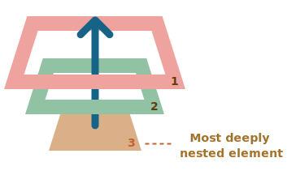

# Bubbling and capturing

Vamos começar com um exemplo.

Este manipulador de eventos foi atribuído a `<div>`, mas também é acionado caso você clique em qualquer elemento aninhado como `<em>` ou `<code>`:

```html autorun height=60
<div onclick="alert('The handler!')">
  <em>Se você clicar no<code>EM</code>, o manipulador na <code>DIV</code> será acionado.</em>
</div>
```

Não é um pouco estranho? Por que o manipulador na `<div>` é acionado se o clique foi no `<em>`?

## Bubbling

O *bubbling*(borbulhamento) é simples.

**Quando um evento acontece em um elemento, ele primeiro executa os manipuladores nesse elemento, depois em seu elemento pai, e em seguida, sobe pelos outros ancestrais.**

Vamos supor que tenhamos 3 elementos aninhados `FORM > DIV > P` com um manipulador em cada um:

```html run autorun
<style>
  body * {
    margin: 10px;
    border: 1px solid blue;
  }
</style>

<form onclick="alert('form')">FORM
  <div onclick="alert('div')">DIV
    <p onclick="alert('p')">P</p>
  </div>
</form>
```

Um clique no `<p>` aciona primeiro o `onclick`:
1. Neste `<p>`.
2. Em seguida, na `<div>` externa.
3. Depois, no `<form>`.
4. E assim em diante até o objeto `document`.



Então, se clicarmos no `<p>`, veremos 3 *alerts*: `p` -> `div` -> `form`.

O processo se chama "bubbling", porque o evento "borbulha" do elemento mais interno para os elementos pais, com uma bolha na água.

```warn header="*Quase todos os eventos borbulham."
A palavra-chave nessa frase é "quase".

Por exemplo, um evento `focus` não borbulha. Existem outros exemplos também, que iremos conhecer. Mas ainda assim é uma exceção, e não a regra. A maioria dos eventos borbulha.
```

## event.target

Um manipulador em um elemento pai sempre pode obter detalhes sobre onde o evento realmente ocorreu.

**O elemento mais interno que causou o evento é chamado de elemento *target*(alvo), acessado como `event.target`.**

Note a diferença de `this` (=`event.currentTarget`):

- `event.target` - é o elemento "*target*(alvo)" que iniciou o evento, ele não muda durante o processo *bubbling*.
- `this` - é o elemento que esta atualmente executando o manipulador.

Por exemplo, se tivermos um único manipulador `form.onclick`, ele poderá capturar todos os cliques dentro do `<form>`. Não importa onde o clique aconteceu, ele borbulha até `<form>` e executa o manipulador.

No manipulador `form.onclick`:

- `this` (=`event.currentTarget`) é o elemento `<form>`, porque o manipulador foi atribuído a ele.
- `event.target` é o elemento dentro do `<form> `que foi clicado.

Confira:

[codetabs height=220 src="bubble-target"]

É possível que `event.target` seja igual a `this` - isso acontece quando o clique é feito diretamente no elemento `<form>`.

## Parando o bubbling

Um evento *bubbling* vai do elemento alvo subindo para os elementos pais. Normalmente, ele sobe até `<html>`, em seguida ao objeto `document`, alguns eventos alcançam até mesmo o `window`, executando todos os manipuladores no caminho.

Mas qualquer manipulador pode decidir se o evento foi totalmente processado e parar o *bubbling*.

O método para isso é `event.stopPropagation()`.

Por exemplo, aqui `body.onclick` não funciona se você clicar no `<button>`:

```html run autorun height=60
<body onclick="alert(`the bubbling doesn't reach here`)">
  <button onclick="event.stopPropagation()">Clique em mim</button>
</body>
```

```smart header="event.stopImmediatePropagation()"
Se um elemento tem múltiplos manipuladores para um único evento, mesmo que um deles interrompa o *bubbling*, os outros ainda serão executados.

Em outras palavras, `event.stopPropagation()` interrompe o movimento ascendente, mas no elemento atual todos os manipuladores serão executados.

Para parar o *bubbling* e prevenir que os manipuladores do elemento atual sejam executados, existe um método `event.stopImmediatePropagation()`. Após isso, nenhum manipulador será executado.
```

```warn header="Não interrompa o *bubbling* desnecessariamente!"
*Bubbling* é conveniente. Não o interrompa sem uma razão óbvia e arquiteturalmente planejada.

Às vezes, `event.stopPropagation()` cria armadilhas que se tornam problemas futuramente.

Por exemplo:

1. Criamos um menu aninhado. Cada submenu lida com cliques em seus elementos e chama `stopPropagation`, de forma que o manipulador do menu externo não seja acionado.
2. Depois decidimos capturar cliques em toda a *window* para observar o comportamento do usuário (onde as pessoas clicam). Algum sistemas analíticos fazem isso. Em geral, os códigos usam `document.addEventListener('click'…)` para capturar todos os cliques.
3. Nossa análise não funcionará nas áreas onde os cliques são interrompidos por `stopPropagation`. Infelizmente, temos uma "zona morta".

Geralmente, não existe necessidade de prevenir o *bubbling*. Uma tarefa que aparentemente necessita disso pode ser resolvida por outros meios. Um deles é usar eventos customizados, que veremos em breve. Também podemos escrever nossos dados no objeto `event` em um manipulador e lê-los em outro, para podermos passar informações sobre o processamento aos manipuladores dos elementos pais.
```


## Capturing

Existe outra fase do processamento de eventos chamada *capturing*(captura). Raramente é usado no dia a dia, mas pode ser útil às vezes.

O Padrão [DOM Events](https://www.w3.org/TR/DOM-Level-3-Events/) descreve três fases da propagação de eventos:

1. Fase de captura -- o evento desce até o elemento.
2. Fase alvo -- o evento alcança o elemento alvo.
3. Fase de borbulhamento -- o evento borbulha do elemento.

Aqui está a imagem da especificação, das fases de captura `(1)`, alvo `(2)` e borbulhamento `(3)` para um evento clique no `<td>` dentro de um table:


Isto é: um evento clique no `<td>`, o evento passa pela cadeia de ancestrais até o elemento (fase de captura), chega ao alvo e aciona lá (fase alvo), depois sobe (fase de borbulhamento), acionando os manipuladores no caminho.

Até agora, só falamos do *bubbling*, *capturing* raramente é utilizado.

Na verdade, a fase de captura é invisível para nós, porque manipuladores adicionados usando a propriedade `on<event>`, atributos HTML ou `addEventListener(event, handler)` não lidam com a captura, sendo executados somente na segunda e terceira fases.

Para pegarmos um evento na fase de captura, nós precisamos configurar a opção `capture` do manipulador como `true`:

```js
elem.addEventListener(..., {capture: true})

// or, just "true" is an alias to {capture: true}
elem.addEventListener(..., true)
```

A opção `capture` tem dois valores possíveis:

- Se for `false` (padrão),  o manipulador é configurado na fase de borbulhamento.
- Se for `true`, o manipulador é configurado para a fase de captura.


Embora existam três fases, a segunda fase (fase alvo: o evento alcançou o elemento) não é tratada separadamente. Manipuladores definidos para as fases de captura e borbulhamento também são acionados nessa fase.

Vejamos a captura e o borbulhamento em ação:

```html run autorun height=140 edit
<style>
  body * {
    margin: 10px;
    border: 1px solid blue;
  }
</style>

<form>FORM
  <div>DIV
    <p>P</p>
  </div>
</form>

<script>
  for(let elem of document.querySelectorAll('*')) {
    elem.addEventListener("click", e => alert(`Capturing: ${elem.tagName}`), true);
    elem.addEventListener("click", e => alert(`Bubbling: ${elem.tagName}`));
  }
</script>
```

O código define manipuladores de clique em todos elementos do documento para ver quais estão funcionando

Se você clicar no `<p>`, a sequência é:

1. `HTML` -> `BODY` -> `FORM` -> `DIV -> P` (fase de captura, o primeiro manipulador):
2. `P` -> `DIV` -> `FORM` -> `BODY` -> `HTML` (fase de borbulhamento, o segundo manipulador).

Note que `P` aparece duas vezes, pois definimos dois manipuladores: um para captura e outro para borbulhamento. O alvo é acionado no final da primeira fase e no início da segunda.

Existe a propriedade `event.eventPhase` que nos diz o número da fase em que o evento foi capturado. Raramente é usada, pois geralmente sabemos a fase no manipulador.

```smart header="Para remover o manipulador, `removeEventListener` deve especificar a mesma fase"
Se usarmos `addEventListener(..., true)`, devemos especificar a mesma fase em `removeEventListener(..., true)` para remover corretamente o manipulador.
```

````smart header="Manipuladores no mesmo elemento e na mesma fase são executados na ordem de atribuição"
Se tivermos múltiplos manipuladores de evento na mesma fase, atribuídos ao mesmo elemento com  `addEventListener`, eles executarão na ordem em que foram criados:

```js
elem.addEventListener("click", e => alert(1)); // dispara primeiro
elem.addEventListener("click", e => alert(2));
```
````

```smart header="O `event.stopPropagation()` durante a captura também impede o borbulhamento"
O `event.stopPropagation()` método e seu irmão `event.stopImmediatePropagation()` também podem ser chamados na fase de captura. Portanto, não só a próxima fase de captura é interrompida como também a fase de borbullhamento.

Em outras palavras, normalmente o evento "desce" ("capturing") e depois sobe ("bubbling"). Mas se `event.stopPropagation()` é chamado na fase de captura, a viagem para, nenhum borbulhamento ocorerá.
```


## Resumo

Quando um evento acontece -- o elemento mais aninhado onde ocorre é etiquetado como o "elemento alvo" (`event.target`).

- Em seguida, o evento se move da raiz do documento para o `event.target`, chamando manipuladores atribuídos com `addEventListener(..., true)` no caminho (`true` is a shorthand for `{capture: true}`).
- Os manipuladores são chamados no próprio elemento alvo.
- Por fim, o evento borbulha do `event.target` até a raiz do documento, chamando manipuladores atribuídps usando `on<event>`, atributos HTML e `addEventListener` without the 3rd argument osem o terceiro argumento ou com o terceiro elemento como `false/{capture:false}`.

Todo manipulador pode acessar as propriedades do objeto `event`:

- `event.target` -- o elemento mais profundo que originou o evento.
- `event.currentTarget` (=`this`) -- o elemento que atualmente manipula o evento (o elemento ao qual o manipulador foi atribuído)
- `event.eventPhase` -- a fase atual (captura=1, alvo=2, borbulhamento=3).

Qualquer manipulador de evento pode parar o evento chhamando `event.stopPropagation()`, mas isso não é recomendado, pois não teremos certeza se não precisaremos dele posteriormente, talvez, para coisas completamente diferentes.

A fase de captura é raramente usada, normalmente lidamos com eventos na fase de borbulhamento. Existe uma explicação lógica para isso.

No mundo real, quando um acidente acontece, autoridades locais reagem primeiro. Eles conhecem melhor a área onde aconteceu. Em seguida, as autoridades de nível superior caso necessário.

É o mesmo com manipuladores de eventos. O código que define o manipulador em um elemento específico sabe o máximo de detalhes sobre o elemento e o que ele faz. Um manipulador em um `<td>` particular pode ser adequado exatamente para esse `<td>`, o manipulador conhece tudo sobre o elemento, portanto deve ter a oportunidade primeiro. O elemento pai também sabe o contexto, um pouco menos, é dessa forma em diante até o elemento no topo, que lida com conceitos gerais e executa o último.

Borbulhamento e captura são as bases para o "event delegation" -- um manipulador de eventos extremamente poderoso que estudaremos no próximo capítulo.