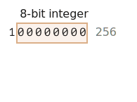

# ArrayBuffer, arrays binários

No desenvolvimento web encontramos dados binários principalmente ao lidar com arquivos (criar, enviar, baixar). Outro caso de uso típico é o processamento de imagens.

Tudo isso é possível em JavaScript, e as operações binárias são de alto desempenho.

No entanto, há um pouco de confusão, porque existem muitas classes. Para citar algumas:
- `ArrayBuffer`, `Uint8Array`, `DataView`, `Blob`, `File`, etc.

Os dados binários em JavaScript são implementados de uma forma não padrão, comparado a outras linguagens. Mas quando organizamos as coisas, tudo se torna bastante simples.

**O objeto binário básico é `ArrayBuffer` -- uma referência a uma área de memória contígua de comprimento fixo.**

Criamos assim:
```js run
let buffer = new ArrayBuffer(16); // cria um buffer de comprimento 16
alert(buffer.byteLength); // 16
```

Isso aloca uma área de memória contígua de 16 bytes e a preenche com zeros.

```warn header="`ArrayBuffer` não é um array de algo"
Vamos eliminar uma possível fonte de confusão. `ArrayBuffer` não tem nada em comum com `Array`:
- Tem um comprimento fixo, não podemos aumentá-lo ou diminuí-lo.
- Ocupa exatamente esse espaço na memória.
- Para acessar bytes individuais, é necessário outro objeto "view", não `buffer[index]`.
```

`ArrayBuffer` é uma área de memória. O que está armazenado nela? Não tem ideia. Apenas uma sequência bruta de bytes.

**Para manipular um `ArrayBuffer`, precisamos usar um objeto "view".**

Um objeto view não armazena nada por si só. São os "óculos" que dão uma interpretação dos bytes armazenados no `ArrayBuffer`.

Por exemplo:

- **`Uint8Array`** -- trata cada byte no `ArrayBuffer` como um número separado, com valores possíveis de 0 a 255 (um byte tem 8 bits, então só pode conter isso). Esse valor é chamado de "inteiro sem sinal de 8 bits".
- **`Uint16Array`** -- trata cada 2 bytes como um inteiro, com valores possíveis de 0 a 65535. Isso é chamado de "inteiro sem sinal de 16 bits".
- **`Uint32Array`** -- trata cada 4 bytes como um inteiro, com valores possíveis de 0 a 4294967295. Isso é chamado de "inteiro sem sinal de 32 bits".
- **`Float64Array`** -- trata cada 8 bytes como um número de ponto flutuante com valores possíveis de <code>5.0x10<sup>-324</sup></code> a <code>1.8x10<sup>308</sup></code>.

Assim, os dados binários em um `ArrayBuffer` de 16 bytes podem ser interpretados como 16 "números pequenos", ou 8 números maiores (2 bytes cada), ou 4 ainda maiores (4 bytes cada), ou 2 valores de ponto flutuante com alta precisão (8 bytes cada).


`ArrayBuffer` é o objeto central, a raiz de tudo, os dados binários brutos.

Mas se vamos escrever nele, ou iterar sobre ele, basicamente para quase qualquer operação – devemos usar uma view, por exemplo:

```js run
let buffer = new ArrayBuffer(16); // cria um buffer de comprimento 16

*!*
let view = new Uint32Array(buffer); // trata o buffer como uma sequência de inteiros de 32 bits

alert(Uint32Array.BYTES_PER_ELEMENT); // 4 bytes por inteiro
*/!*

alert(view.length); // 4, armazena essa quantidade de inteiros
alert(view.byteLength); // 16, o tamanho em bytes

// vamos escrever um valor
view[0] = 123456;

// iterar sobre os valores
for(let num of view) {
  alert(num); // 123456, depois 0, 0, 0 (4 valores no total)
}

```

## TypedArray

O termo comum para todas essas views (`Uint8Array`, `Uint32Array`, etc) é [TypedArray](https://tc39.github.io/ecma262/#sec-typedarray-objects). Elas compartilham o mesmo conjunto de métodos e propriedades.

Note que não há um construtor chamado `TypedArray`, é apenas um termo comum "guarda-chuva" para representar uma das views sobre `ArrayBuffer`: `Int8Array`, `Uint8Array` e assim por diante, a lista completa virá em breve.

Quando você vê algo como `new TypedArray`, significa qualquer um de `new Int8Array`, `new Uint8Array`, etc.

Arrays tipados se comportam como arrays regulares: têm índices e são iteráveis.

Um construtor de array tipado (seja `Int8Array` ou `Float64Array`, não importa) se comporta de forma diferente dependendo dos tipos de argumentos.

Existem 5 variantes de argumentos:

```js
new TypedArray(buffer, [byteOffset], [length]);
new TypedArray(object);
new TypedArray(typedArray);
new TypedArray(length);
new TypedArray();
```

1. Se um argumento `ArrayBuffer` for fornecido, a view é criada sobre ele. Já usamos essa sintaxe.

    Opcionalmente podemos fornecer `byteOffset` para começar (0 por padrão) e o `length` (até o fim do buffer por padrão), então a view cobrirá apenas uma parte do `buffer`.

2. Se um `Array`, ou qualquer objeto semelhante a array for fornecido, cria um array tipado do mesmo comprimento e copia o conteúdo.

    Podemos usá-lo para pré-preencher o array com os dados:
    ```js run
    *!*
    let arr = new Uint8Array([0, 1, 2, 3]);
    */!*
    alert( arr.length ); // 4, criou array binário do mesmo comprimento
    alert( arr[1] ); // 1, preenchido com 4 bytes (inteiros sem sinal de 8 bits) com os valores dados
    ```
3. Se outro `TypedArray` for fornecido, faz o mesmo: cria um array tipado do mesmo comprimento e copia os valores. Os valores são convertidos para o novo tipo no processo, se necessário.
    ```js run
    let arr16 = new Uint16Array([1, 1000]);
    *!*
    let arr8 = new Uint8Array(arr16);
    */!*
    alert( arr8[0] ); // 1
    alert( arr8[1] ); // 232, tentou copiar 1000, mas não consegue encaixar 1000 em 8 bits (explicações abaixo)
    ```

4. Para um argumento numérico `length` -- cria o array tipado para conter essa quantidade de elementos. Seu comprimento em bytes será `length` multiplicado pelo número de bytes em um único item `TypedArray.BYTES_PER_ELEMENT`:
    ```js run
    let arr = new Uint16Array(4); // cria array tipado para 4 inteiros
    alert( Uint16Array.BYTES_PER_ELEMENT ); // 2 bytes por inteiro
    alert( arr.byteLength ); // 8 (tamanho em bytes)
    ```

5. Sem argumentos, cria um array tipado de comprimento zero.

Podemos criar um `TypedArray` diretamente, sem mencionar `ArrayBuffer`. Mas uma view não pode existir sem um `ArrayBuffer` subjacente, então é criado automaticamente em todos esses casos, exceto no primeiro (quando fornecido).

Para acessar o `ArrayBuffer` subjacente, existem as seguintes propriedades em `TypedArray`:
- `buffer` -- referencia o `ArrayBuffer`.
- `byteLength` -- o comprimento do `ArrayBuffer`.

Assim, sempre podemos passar de uma view para outra:
```js
let arr8 = new Uint8Array([0, 1, 2, 3]);

// outra view sobre os mesmos dados
let arr16 = new Uint16Array(arr8.buffer);
```


Aqui está a lista de arrays tipados:

- `Uint8Array`, `Uint16Array`, `Uint32Array` -- para números inteiros de 8, 16 e 32 bits.
  - `Uint8ClampedArray` -- para inteiros de 8 bits, os "limita" na atribuição (veja abaixo).
- `Int8Array`, `Int16Array`, `Int32Array` -- para números inteiros com sinal (podem ser negativos).
- `Float32Array`, `Float64Array` -- para números de ponto flutuante com sinal de 32 e 64 bits.

```warn header="Sem `int8` ou tipos de valor único similares"
Note que, apesar dos nomes como `Int8Array`, não existe um tipo de valor único como `int`, ou `int8` em JavaScript.

Isso é lógico, pois `Int8Array` não é um array desses valores individuais, mas sim uma view sobre `ArrayBuffer`.
```

### Comportamento fora dos limites

E se tentarmos escrever um valor fora dos limites em um array tipado? Não haverá erro. Mas os bits extras são cortados.

Por exemplo, vamos tentar colocar 256 em `Uint8Array`. Na forma binária, 256 é `100000000` (9 bits), mas `Uint8Array` fornece apenas 8 bits por valor, o que torna o intervalo disponível de 0 a 255.

Para números maiores, apenas os 8 bits mais à direita (menos significativos) são armazenados, e o resto é cortado:



Então obteremos zero.

Para 257, a forma binária é `100000001` (9 bits), os 8 mais à direita são armazenados, então teremos `1` no array:


Em outras palavras, o número módulo 2<sup>8</sup> é salvo.

Aqui está a demonstração:

```js run
let uint8array = new Uint8Array(16);

let num = 256;
alert(num.toString(2)); // 100000000 (representação binária)

uint8array[0] = 256;
uint8array[1] = 257;

alert(uint8array[0]); // 0
alert(uint8array[1]); // 1
```

`Uint8ClampedArray` é especial nesse aspecto, seu comportamento é diferente. Salva 255 para qualquer número maior que 255, e 0 para qualquer número negativo. Esse comportamento é útil para processamento de imagens.

## Métodos TypedArray

`TypedArray` tem métodos regulares de `Array`, com exceções notáveis.

Podemos iterar, `map`, `slice`, `find`, `reduce` etc.

Há algumas coisas que não podemos fazer:

- Sem `splice` -- não podemos "deletar" um valor, porque arrays tipados são views sobre um buffer, e essas são áreas fixas e contíguas de memória. Tudo que podemos fazer é atribuir um zero.
- Sem método `concat`.

Existem dois métodos adicionais:

- `arr.set(fromArr, [offset])` copia todos os elementos de `fromArr` para `arr`, começando na posição `offset` (0 por padrão).
- `arr.subarray([begin, end])` cria uma nova view do mesmo tipo de `begin` a `end` (exclusivo). Isso é semelhante ao método `slice` (que também é suportado), mas não copia nada -- apenas cria uma nova view, para operar no pedaço de dados dado.

Esses métodos nos permitem copiar arrays tipados, misturá-los, criar novos arrays a partir dos existentes, e assim por diante.


## DataView

[DataView](mdn:/JavaScript/Reference/Global_Objects/DataView) é uma view especial superflexível "não tipada" sobre `ArrayBuffer`. Permite acessar os dados em qualquer deslocamento em qualquer formato.

- Para arrays tipados, o construtor dita qual é o formato. Todo o array deve ser uniforme. O i-ésimo número é `arr[i]`.
- Com `DataView` acessamos os dados com métodos como `.getUint8(i)` ou `.getUint16(i)`. Escolhemos o formato no momento da chamada do método, em vez do momento da construção.

A sintaxe:

```js
new DataView(buffer, [byteOffset], [byteLength])
```

- **`buffer`** -- o `ArrayBuffer` subjacente. Diferente dos arrays tipados, `DataView` não cria um buffer por conta própria. Precisamos tê-lo pronto.
- **`byteOffset`** -- a posição de byte inicial da view (0 por padrão).
- **`byteLength`** -- o comprimento em bytes da view (por padrão até o fim de `buffer`).

Por exemplo, aqui extraímos números em diferentes formatos do mesmo buffer:

```js run
// array binário de 4 bytes, todos têm o valor máximo 255
let buffer = new Uint8Array([255, 255, 255, 255]).buffer;

let dataView = new DataView(buffer);

// obtém número de 8 bits no deslocamento 0
alert( dataView.getUint8(0) ); // 255

// agora obtém número de 16 bits no deslocamento 0, consiste de 2 bytes, juntos interpretados como 65535
alert( dataView.getUint16(0) ); // 65535 (maior inteiro sem sinal de 16 bits)

// obtém número de 32 bits no deslocamento 0
alert( dataView.getUint32(0) ); // 4294967295 (maior inteiro sem sinal de 32 bits)

dataView.setUint32(0, 0); // define número de 4 bytes como zero, assim definindo todos os bytes como 0
```

`DataView` é ótimo quando armazenamos dados de formato misto no mesmo buffer. Por exemplo, quando armazenamos uma sequência de pares (inteiro de 16 bits, float de 32 bits), `DataView` permite acessá-los facilmente.

## Resumo

`ArrayBuffer` é o objeto central, uma referência à área de memória contígua de comprimento fixo.

Para fazer quase qualquer operação em `ArrayBuffer`, precisamos de uma view.

- Pode ser um `TypedArray`:
    - `Uint8Array`, `Uint16Array`, `Uint32Array` -- para inteiros sem sinal de 8, 16 e 32 bits.
    - `Uint8ClampedArray` -- para inteiros de 8 bits, os "limita" na atribuição.
    - `Int8Array`, `Int16Array`, `Int32Array` -- para números inteiros com sinal (podem ser negativos).
    - `Float32Array`, `Float64Array` -- para números de ponto flutuante com sinal de 32 e 64 bits.
- Ou um `DataView` -- a view que usa métodos para especificar um formato, por exemplo `getUint8(offset)`.

Na maioria dos casos criamos e operamos diretamente em arrays tipados, deixando `ArrayBuffer` sob cobertura, como um "denominador comum". Podemos acessá-lo como `.buffer` e fazer outra view se necessário.

Existem também dois termos adicionais, que são usados em descrições de métodos que operam em dados binários:
- `ArrayBufferView` é um termo guarda-chuva para todos esses tipos de views.
- `BufferSource` é um termo guarda-chuva para `ArrayBuffer` ou `ArrayBufferView`.

Veremos esses termos nos próximos capítulos. `BufferSource` é um dos termos mais comuns, pois significa "qualquer tipo de dado binário" -- um `ArrayBuffer` ou uma view sobre ele.

Aqui está uma referência rápida:


