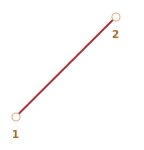
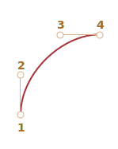
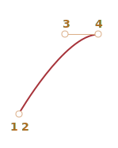

# Animações CSS

Animações CSS nos permitem criar animações simples sem usar *Javascript*.

*Javascript* pode ser usado para controlar a animação CSS e torná-la ainda melhor com pouco código.

## Transições CSS [#css-transition]

A idéia das transições CSS é simples. Descrevemos uma propriedade e como suas mudanças devem ser animadas. Quando a propriedade muda, o navegador desenha a animação.

Isto é: tudo que precisamos fazer é mudar uma propriedade. E a transição fluida é feita pelo navegador.

Por exemplo, o CSS abaixo anima as mudanças em `background-color` por 3 segundos:

```css
.animated {
  transition-property: background-color;
  transition-duration: 3s;
}
```

Agora, se algum elemento possui a classe `.animated`, qualquer mudança em `background-color` é animada durante 3 segundos.

Clique no botão abaixo para animar a cor de seu fundo:

```html run autorun height=60
<button id="color">Clique-me!</button>

<style>
  #color {
    transition-property: background-color;
    transition-duration: 3s;
  }
</style>

<script>
  color.onclick = function() {
    this.style.backgroundColor = 'red';
  };
</script>
```

Existem 4 propriedades que descrevem as transições CSS:

- `transition-property`
- `transition-duration`
- `transition-timing-function`
- `transition-delay`

Iremos falar delas daqui a pouco, por ora notemos que a propriedade comum `transition` permite declará-las juntas na ordem: `property duration timing-function delay`, e permite também animar várias propriedades de uma vez.

Por exemplo, esse botão anima as propriedades `color` e `font-size` ao mesmo tempo:

```html run height=80 autorun no-beautify
<button id="growing">Clique-me!</button>

<style>
#growing {
*!*
  transition: font-size 3s, color 2s;
*/!*
}
</style>

<script>
growing.onclick = function() {
  this.style.fontSize = '36px';
  this.style.color = 'red';
};
</script>
```

Agora, vamos falar de cada uma das propriedades de animação.

## transition-property

Em `transition-property`, escrevemos uma lista de propriedades para animar, por exemplo: `left`, `margin-left`, `height`, `color`. Ou podemos escrever `all`, que significa "animar todas as propriedades".

Note que nem todas as propriedades podem ser animadas, mas [a maioria das propriedades habitualmente utilizadas são animáveis](https://developer.mozilla.org/en-US/docs/Web/CSS/CSS_animated_properties).

## transition-duration

<<<<<<< HEAD
Em `transition-duration` especificamos quanto tempo a animação deve durar. Ele deve estar em [formato de tempo CSS](http://www.w3.org/TR/css3-values/#time): em segundos `s` ou milissegundos `ms`.
=======
In `transition-duration` we can specify how long the animation should take. The time should be in [CSS time format](https://www.w3.org/TR/css3-values/#time): in seconds `s` or milliseconds `ms`.
>>>>>>> 540d753e90789205fc6e75c502f68382c87dea9b

## transition-delay

Em `transition-delay` especificamos o atraso *antes* da animação começar. Por exemplo, se `transition-delay` é `1s` e `transition-duration` é `2s`, então a animação começa 1 segundo depois da mudança da propriedade e a duração total é de 2 segundos.

Valores negativos também são possíveis. Dessa forma, a animação começa imediatamente, mas o ponto inicial da animação é depois do valor dado (tempo). Por exemplo, se `transition-delay` for `-1s` e `transition-duration` forem `2s`,  então a animação começa do estado que estaria na metade de seu ciclo e dura 1 segundo.

Essa é uma animação que desloca números de `0` a `9` usando a propriedade CSS `translate`:

[codetabs src="digits"]

A propriedade `transform` é animada assim:

```css
#stripe.animate {
  transform: translate(-90%);
  transition-property: transform;
  transition-duration: 9s;
}
```

No exemplo acima, *Javascript* adiciona a classe `.animate` no elemento, iniciando a animação:

```js
stripe.classList.add('animate');
```

Podemos também iniciar a animação "do meio" da transição, de um número exato, por exemplo correspondendo ao segundo atual, usando um valor negativo em `transition-delay`.

Nesse exemplo, se você clicar no dígito, ele iniciará a animação à partir do segundo atual:

[codetabs src="digits-negative-delay"]

*JavaScript* faz isso por meio de uma linha extra:

```js
stripe.onclick = function() {
  let sec = new Date().getSeconds() % 10;
*!*
  // por exemplo, -3s aqui inicia a animação à partir do terceiro segundo
  stripe.style.transitionDelay = '-' + sec + 's';
*/!*
  stripe.classList.add('animate');
};
```

## transition-timing-function

A *timing function* (função de sincronização) descreve como o processo da animação é distribuído ao longo do tempo. Por exemplo, ela deve começar devagar e depois acelerar ou vice e versa.

Essa parece ser a propriedade mais complicada à primeira vista. Mas fica simples se dedicarmos um pouco de tempo para ela.

Essa propriedade aceita dois tipos de valores: uma curva Bezier ou *steps* (passos). Vamos começar com a curva, pois ela é usada com mais frequência.

### Curva Bezier

A *timing function* pode ser configurada como uma [curva Bezier](/bezier-curve) com 4 pontos de controle que satisfaça as condições:

1. Primeiro ponto de controle: `(0,0)`.
2. Último ponto de controle: `(1,1)`.
3. Para pontos intermediários, os valores de `x` precisam de estar no intervalo `0..1`, `y` pode ser qualquer coisa.

A sintaxe para a curva Bezier no CSS é: `cubic-bezier(x2, y2, x3, y3)`. Aqui precisamos especificar somente o segundo e o terceiro pontos de controle, porque o primeiro é fixado em `(0,0)` e o quarto, em `(1,1)`.

A *timing function* descreve o quão rápido a animação acontece no tempo:

- O eixo `x` é o tempo: `0` -- o início, `1` -- o fim da `transition-duration`.
- O eixo `y` especifica o estado do processo: `0` -- representa o valor inicial da propriedade, `1` -- representa o valor final.

A variação mais simples é quando a animação acontece uniformemente, com a mesma velocidade linear. Ela pode ser especificada pela curva `cubic-bezier(0, 0, 1, 1)`.

A curva se assemelha à imagem abaixo:



...Como podemos ver, é apenas uma linha reta. Conforme o tempo (`x`) passa, o estado da animação (`y`) passa de forma uniforme de `0` para `1`.

O trem no exemplo abaixo vai da esquerda para a direita com uma velocidade permanente (clique sobre ele para ver):

[codetabs src="train-linear"]

A propriedade CSS `transition` é baseada na curva:

```css
.train {
  left: 0;
  transition: left 5s cubic-bezier(0, 0, 1, 1);
  /* clicando numa cadeia configura a propriedade left para 450px, desencadeando assim a animação */
}
```

...E como podemos mostrar um trem desacelerando?

Podemos usar uma outra curva Bezier: `cubic-bezier(0.0, 0.5, 0.5 ,1.0)`.

Seu gráfico:



Como podemos ver, o processo começa rápido: a curva inclina-se para o alto, e depois, inclina-se menos e menos.

Aqui está a curva em ação (clique no trem para ver):

[codetabs src="train"]

CSS:
```css
.train {
  left: 0;
  transition: left 5s cubic-bezier(0, .5, .5, 1);
  /* clicando numa cadeia configura a propriedade left para 450px, desencadeando assim a animação */
}
```

Existem várias curvas embutidas: `linear`, `ease`, `ease-in`, `ease-out` e `ease-in-out`.

A `linear` é uma abreviação para `cubic-bezier(0, 0, 1, 1)` -- uma linha reta, como descrevemos acima.

Outros nomes são usados como abreviações para as seguintes `cubic-bezier`:

| <code>ease</code><sup>*</sup> | <code>ease-in</code> | <code>ease-out</code> | <code>ease-in-out</code> |
|-------------------------------|----------------------|-----------------------|--------------------------|
| <code>(0.25, 0.1, 0.25, 1.0)</code> | <code>(0.42, 0, 1.0, 1.0)</code> | <code>(0, 0, 0.58, 1.0)</code> | <code>(0.42, 0, 0.58, 1.0)</code> |
|  |  |  |  |

`*` -- por padrão, se nenhuma curva é especificada, `ease` é usada.

Então, podemos usar `ease-out` para desacelerar nosso trem:

```css
.train {
  left: 0;
  transition: left 5s ease-out;
  /* same as transition: left 5s cubic-bezier(0, .5, .5, 1); */
}
```

Mas ele parece um pouco diferente.

**Uma curva Bezier pode fazer uma animação "pular fora" de seu alcance.**

Os pontos de controle da curva podem ter qualquer valor para a coordenada `y`: até mesmo negativo ou enorme. Então, a curva Bezier também pularia muito baixo ou muito alto, fazendo com que a animação vá além de seu alcance normal.

<<<<<<< HEAD
No exemplo abaixo, o código da animação é:
=======
In the example below the animation code is:

>>>>>>> 540d753e90789205fc6e75c502f68382c87dea9b
```css
.train {
  left: 100px;
  transition: left 5s cubic-bezier(.5, -1, .5, 2);
  /* clicando numa cadeia configura a propriedade left para 400px */
}
```

A propriedade `left` deve animar de `100px` para `400px`.

Mas, se você clicar no trem, verá que:

- Primeiro, o trem *volta*: `left` se torna menos que `100px`.
- Depois ele vai para frente, um pouco mais longe de `400px`.
- E depois volta novamente -- para `400px`.

[codetabs src="train-over"]

Por que isso acontece é realmente óbvio se olharmos para o gráfico da seguinte curva Bezier:


Nós movemos a coordenada `y` do segundo ponto para abaixo de zero, e para o terceiro ponto, o fizemos acima de `1`, então a curva ultrapassa seu quadrante "regular". O `y` está fora de seu alcance "padrão" `0..1`.

Como sabemos, `y` mede "o estado do processo da animação". O valor `y = 0` corresponde ao valor inicial da propriedade e `y = 1` -- ao valor final. Então, o valor `y<0` move a propriedade abaixo do inicial `left` e `y>1` -- para além do valor final `left`.

Essa é uma variação "leve". Se definirmos valores de `y` como `-99` e `99` então, o trem pularia ainda mais fora de seu alcance.

<<<<<<< HEAD
Mas, como criar uma curva Bezier para uma tarefa específica? Existem várias ferramentas. Por exemplo, podemos fazer isso em <http://cubic-bezier.com/>.
=======
But how do we make a Bezier curve for a specific task? There are many tools.

- For instance, we can do it on the site <https://cubic-bezier.com>.
- Browser developer tools also have special support for Bezier curves in CSS:
    1. Open the developer tools with `key:F12` (Mac: `key:Cmd+Opt+I`).
    2. Select the `Elements` tab, then pay attention to the `Styles` sub-panel at the right side.
    3. CSS properties with a word `cubic-bezier` will have an icon before this word.
    4. Click this icon to edit the curve.

>>>>>>> 540d753e90789205fc6e75c502f68382c87dea9b

### Steps (Passos)

A função de tempo `steps(number of steps[, start/end])` nos permite separar uma transição em múltiplos passos.

Vamos examiná-la em um exemplo com dígitos.

Aqui está uma lista de dígitos, sem nenhuma animação, apenas a fonte:

[codetabs src="step-list"]

<<<<<<< HEAD
Nós iremos fazer com que os dígitos apareçam de uma forma discreta, tornando invisível a parte da lista fora da "janela" vermelha e deslocando a lista para a esquerda a cada passo.
=======
In the HTML, a stripe of digits is enclosed into a fixed-length `<div id="digits">`:

```html
<div id="digit">
  <div id="stripe">0123456789</div>
</div>
```

The `#digit` div has a fixed width and a border, so it looks like a red window.

We'll make a timer: the digits will appear one by one, in a discrete way.

To achieve that, we'll hide the `#stripe` outside of `#digit` using `overflow: hidden`, and then shift the `#stripe` to the left step-by-step.
>>>>>>> 540d753e90789205fc6e75c502f68382c87dea9b

Haverá 9 passos, um para cada dígito:

```css
#stripe.animate  {
  transform: translate(-90%);
  transition: transform 9s *!*steps(9, start)*/!*;
}
```

<<<<<<< HEAD
Em ação:

[codetabs src="step"]

O primeiro argumento de `steps(9, start)` é o número de passos. A transformação será dividida em 9 partes (10% cada). O intervalo de tempo é dividido automaticamente em 9 partes também, então `transition: 9s` nos dá 9 segundos para a animação inteira -- 1 segundo por dígito.
=======
The first argument of `steps(9, start)` is the number of steps. The transform will be split into 9 parts (10% each). The time interval is automatically divided into 9 parts as well, so `transition: 9s` gives us 9 seconds for the whole animation – 1 second per digit.
>>>>>>> 540d753e90789205fc6e75c502f68382c87dea9b

O segundo argumento é umas das duas palavras: `start`("início") ou `end`("fim").

O `start` significa que, no início da animação, precisamos executar o primeiro passo imediatamente.

<<<<<<< HEAD
Nós podemos observar isso na animação: quando clicamos no dígito, ele muda para `1` (o primeiro passo) imediatamente, e depois muda para o início do segundo passo.
=======
In action:

[codetabs src="step"]

A click on the digit changes it to `1` (the first step) immediately, and then changes in the beginning of the next second.
>>>>>>> 540d753e90789205fc6e75c502f68382c87dea9b

O processo evolui assim:

- `0s` -- `-10%` (primeira mudança no início do primeiro segundo, imediatamente)
- `1s` -- `-20%`
- ...
<<<<<<< HEAD
- `8s` -- `-80%`
- (o último segundo mostra o valor final).

O valor alternativo `end` significaria que a mudança devesse ser aplicada não no início, mas ao final de cada segundo.
=======
- `8s` -- `-90%`
- (the last second shows the final value).

Here, the first change was immediate because of `start` in the `steps`.

The alternative value `end` would mean that the change should be applied not in the beginning, but at the end of each second.
>>>>>>> 540d753e90789205fc6e75c502f68382c87dea9b

Então, o processo para `steps(9, end)` evoluiria assim:

- `0s` -- `0` (durante o primeiro segundo nada acontece)
- `1s` -- `-10%` (primeira mudança no final do primeiro segundo)
- `2s` -- `-20%`
- ...
- `9s` -- `-90%`

<<<<<<< HEAD
Aqui está o `steps(9, end)` em ação (note a pausa antes da primeira mudança de dígito):

[codetabs src="step-end"]

Existem também valores abreviados:
=======
Here's `steps(9, end)` in action (note the pause before the first digit change):

[codetabs src="step-end"]

There are also some pre-defined shorthands for `steps(...)`:
>>>>>>> 540d753e90789205fc6e75c502f68382c87dea9b

- `step-start` -- é o mesmo que `steps(1, start)`. Isto é, a animação inicia-se imediatamente e leva 1 passo. Então, ela começa e acaba imediatamente, como se não houvesse animação.
- `step-end` -- o mesmo que `steps(1, end)`: executa a animação em um único passo ao final de `transition-duration`.

<<<<<<< HEAD
Esses valores são usados raramente, porque não são realmente animações, mas sim, uma mudança de um único passo.

## Evento *transitionend* (transitado)

Quando a animação CSS é finalizada, o evento `transitionend` é disparado.
=======
These values are rarely used, as they represent not a real animation, but rather a single-step change. We mention them here for completeness.

## Event: "transitionend"

When the CSS animation finishes, the `transitionend` event triggers.
>>>>>>> 540d753e90789205fc6e75c502f68382c87dea9b

É amplamente usado para executar uma ação assim que animação é finalizada. Também podemos utilizadas são animáveis-lo para encadear animações.

Por exemplo, ao clicar no navio do exemplo abaixo, ele começa a navegar para frente e para trás, indo, a cada vez, mais e mais longe para a direita:

[iframe src="boat" height=300 edit link]

A animação é iniciada por meio da função `go` que é re-executada a cada vez que a transição chega ao fim, mudando aí de direção:

```js
boat.onclick = function() {
  //...
  let times = 1;

  function go() {
    if (times % 2) {
      // navegue para a direita
      boat.classList.remove('back');
      boat.style.marginLeft = 100 * times + 200 + 'px';
    } else {
      // navegue para a esquerda
      boat.classList.add('back');
      boat.style.marginLeft = 100 * times - 200 + 'px';
    }

  }

  go();

  boat.addEventListener('transitionend', function() {
    times++;
    go();
  });
};
```

O objeto do evento `transitionend` possui algumas propriedades específicas:

`event.propertyName`
: A propriedade que acabou de ser animada. Pode ser útil se animarmos múltiplas propriedades ao mesmo tempo.

`event.elapsedTime`
: O tempo (em segundos) que a animação dura, sem `transition-delay`.

## Keyframes (quadros-chaves)

Nós podemos unir diversas animações simples juntas usando a regra CSS `@keyframes`.

Ela especifica o "nome" da animação e regras: o quê, quando e onde animar. Então, usando a propriedade `animation` nós anexamos a animação ao elemento e especificamos parâmetros adicionais.

Veja um exemplo com explicações:

```html run height=60 autorun="no-epub" no-beautify
<div class="progress"></div>

<style>
*!*
  @keyframes go-left-right {        /* dá um nome: "go-left-right" (vá-para-esquerda-direita) */
    from { left: 0px; }             /* anima de left: 0px */
    to { left: calc(100% - 50px); } /* anima para left: 100%-50px */
  }
*/!*

  .progress {
*!*
    animation: go-left-right 3s infinite alternate;
    /* aplica a animação "go-left-right" ao elemento
       duração de 3 segundos
       número de vezes: infinite (infinito)
       alterna a direção a cada vez
    */
*/!*

    position: relative;
    border: 2px solid green;
    width: 50px;
    height: 20px;
    background: lime;
  }
</style>
```

Existem vários artigos sobre `@keyframes` e uma [especificação detalhada](https://drafts.csswg.org/css-animations/).

Provavelmente, você não precisará de `@keyframes` regularmente, a não ser que tudo estiver em movimento constante em sua página.

## Desempenho (performance)

A maioria das propriedades CSS podem ser animadas, porque a maioria delas são valores numéricos. Por exemplo, `width`, `color`, `font-size` são todas números. Quando você as anima, o navegador gradualmente muda estes números quadro por quadro, criando um efeito suave.

Contudo, nem todas as animações parecerão tão suaves como você gostaria, porque diferentes propriedades CSS custam a mudar de forma diferente.

Em detalhes mais técnicos, quando há uma mudança de estilo, o navegador passa por três passos para apresentar o novo aspeto:

1. **Layout (estrutura)**: re-computa a geometria e posição de cada elemento, depois
2. **Paint (pintura)**: re-computa como tudo deveria parecer nos seus lugares, incluindo fundo, cores,
3. **Composite (composição)**: apresenta os resultados finais no ecrã em pixels, e aplica transformações CSS se elas existirem.

Durante uma animação CSS, este processo se repete para cada quadro. Contudo, propriedades CSS que nunca afetem a geometria ou posição, tais como `color`, podem saltar o passo *Layout*. Se `color` se alterar, o navegador não calcula nenhuma nova geometria, ele vai para *Paint* -> *Composite*. E existem umas poucas propriedades que vão diretamente para *Composite*. Você pode encontrar uma longa lista de propriedades CSS e que estágios elas desencadeiam em <https://csstriggers.com>.

As calculações podem levar tempo, especialmente em páginas com muitos elementos e uma estrutura complexa. E os atrasos são na verdade visíveis em muitos dispositivos, levando a animações menos fluidas e "saltitantes".

Animações de propriedades que saltam o passo Layout são mais rápidas. E ainda melhor é se Paint também for saltado.

A propriedade `transform` é uma grande escolha, porque:
- Transformações CSS afetam a caixa do elemento alvo num todo (rodam, viram, esticam, deslocam ela).
- Transformações CSS nunca afetam elementos vizinhos.

...Assim navegadores aplicam `transform` "por cima" de cálculos de Layout e Paint, no estágio Composite.

Por outras palavras, o navegador calcula a Layout (tamanhos, posições), pinta-a com cores, fundo, etc no estágio Paint, e depois aplica `transform` a caixas de elementos que precisarem.

Mudanças (animações) da propriedade `transform` nunca desencadeiam os passos Layout e Paint. E ainda mais, o navegador explora o acelerador de gráficos (um *chip* especial na *CPU* ou placa gráfica) para transformações CSS, tornando-as assim muito eficientes.

Felizmente, a propriedade `transform` é muito poderosa. Ao usar `transform` em um elemento, você pode rodá-lo e virá-lo, esticá-lo e encolhê-lo, deslocá-lo, e [muito mais](https://developer.mozilla.org/pt-BR/docs/Web/CSS/transform), Assim, em vez das propriedades `left/margin-left` nós podemos usar `transform: translateX(…)`, usar `transform: scale` para aumentar o tamanho de um elemento, etc.

A propriedade `opacity` também nunca desencadeia Layout (e também salta Paint no Mozilla Gecko). Você a pode usar para efeitos mostrar/esconder ou *fade-in/fade-out*.

Formando um par com `transform` e `opacity` geralmente pode resolver muitas das nossas necessidades, provendo animações fluidas e com bom aspeto.

<<<<<<< HEAD
Por exemplo, clicando aqui no elemento `#boat` é adicionada a classe com `transform: translateX(300)` e `opacity: 0`, fazendo-o mover `300px` para a direita e desaparecer:
=======
For example, here clicking on the `#boat` element adds the class with `transform: translateX(300px)` and `opacity: 0`, thus making it move `300px` to the right and disappear:
>>>>>>> 540d753e90789205fc6e75c502f68382c87dea9b

```html run height=260 autorun no-beautify


<style>
#boat {
  cursor: pointer;
  transition: transform 2s ease-in-out, opacity 2s ease-in-out;
}

.move {
  transform: translateX(300px);
  opacity: 0;
}
</style>
<script>
  boat.onclick = () => boat.classList.add('move');
</script>
```

Aqui está um exemplo mais complexo com `@keyframes`:

```html run height=80 autorun no-beautify
<h2 onclick="this.classList.toggle('animated')">clique em mim para começar / parar</h2>
<style>
  .animated {
    animation: hello-goodbye 1.8s infinite;
    width: fit-content;
  }
  @keyframes hello-goodbye {
    0% {
      transform: translateY(-60px) rotateX(0.7turn);
      opacity: 0;
    }
    50% {
      transform: none;
      opacity: 1;
    }
    100% {
      transform: translateX(230px) rotateZ(90deg) scale(0.5);
      opacity: 0;
    }
  }
</style>
```
## Resumo

Animações CSS permitem animar de forma suave (ou passo-a-passo) mudanças em uma ou diversas propriedades CSS.

Elas são úteis para a maioria das tarefas envolvendo animações. Também podemos usar *Javascript* para animações, o próximo capítulo é dedicado a isso.

Limitações de animações CSS comparadas a animações usando *JavaScript*:

```compare plus="CSS animations" minus="JavaScript animations"
+ Animações simples de forma simples.
+ Rápidas e leves para a CPU.
- Animações *Javascript* são flexíveis. Elas podem produzir qualquer lógica de animação, como a "explosão" de um elemento.
- Não são apenas as propriedades que mudam. Podemos criar novos elementos em *JavaScript* como parte da animação.
```

Em exemplos anteriores deste capítulo, nós animamos `font-size`, `left`, `width`, `height`, etc. Em projetos na vida real, nós deveríamos usar `transform: scale()` e `transform: translate()` para melhor desempenho.

A maioria das animações pode ser implementada usando CSS como descrito nesse capítulo. E o evento `transitionend` nos permite rodar *Javascript* após a animação, integrando-se bem com o código.

Mas, no próximo capítulo, iremos criar animações em *Javascript* para cobrir casos mais complexos.
