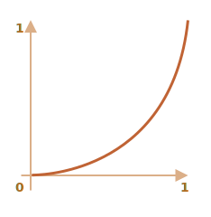

# Animações em JavaScript

Animações em JavaScript podem lidar com situações que CSS não pode.

Por exemplo, movimentação por um caminho complexo, com uma função de tempo diferente das curvas de Bezier, ou uma animação em um canvas.

## Utilizando setInterval

A animação pode ser implementada como uma sequência de frames (quadros) -- geralmente pequenas modificações nas propriedades de HTML/CSS.

Por exemplo, modificando `style.left` de `0px` para `100px` move o elemento. E se aumentarmos em `setInterval`, mudando por `2px` com um pequeno atraso, como 50 vezes por segundo, parecerá suave. Este é o mesmo princípio do cinema: 24 quadros por segundo é o suficiente para fazer com que pareça suave.

O pseudo-código pode ficar assim:

```js
let timer = setInterval(function() {
  if (animation complete) clearInterval(timer);
  else increase style.left by 2px
}, 20); //aumenta 2px a cada 20ms, em média 50 quadros por segundo
```

Exemplo mais completo da animação:

```js
let start = Date.now(); // preservar o tempo inicial

let timer = setInterval(function() {
  // quanto tempo passou desde o início?
  let timePassed = Date.now() - start;

  if (timePassed >= 2000) {
    clearInterval(timer); // finaliza a animação depois de 2 segundos
    return;
  }

  // desenha a animação no momento timePassed
  draw(timePassed);

}, 20);

// timePassed vai de 0 a 2000
// recebe valores de 0 a 400px
function draw(timePassed) {
  train.style.left = timePassed / 5 + 'px';
}
```

Clique para a demo:

[codetabs height=200 src="move"]

## Utilizando requestAnimationFrame

Vamos imaginar que temos diversas animações sendo executadas simultaneamente.

Se as execurtamos separadamente, mesmo que cada uma tenha `setInterval(..., 20)`, então o navegador teria que repintar com mais frequência que a cada `20ms`.

Isso se deve a diferença de tempo de início entre a animação e o navegador, então "cada 20ms" não é o mesmo para diferentes animações. Os intervalos não são alinhados. Então teremos diversas execuções independentes dentro de `20ms`.

Em outras palavras, isso:

```js
setInterval(function () {
  animate1();
  animate2();
  animate3();
}, 20)
```

...É mais leve que três referências independentes:

```js
setInterval(animate1, 20); // animações independentes
setInterval(animate2, 20); // em diferentes lugares do script
setInterval(animate3, 20);
```

Esses diferentes redesenhos deveriam ser agrupados juntos, para fazer com o que o redesenho seja mais fácil para o navegador (e, portanto, mais suave para as pessoas).

Tem mais uma coisa a ser manter em mente. Às vezes, quando a CPU está sobrecarregada, ou quando existem outras reazões para resesenhar com menos frequência (como quando a aba do navegador está escondida), então não devemos executá-la a cada `20ms`.

Mas como sabemos disso em JavaScript? Existe uma especificação [Tempo de animação](http://www.w3.org/TR/animation-timing/) que fornece a função `requestAnimationFrame`. Ela aborda todos esses problemas e mais.

A sintaxe:
```js
let requestId = requestAnimationFrame(callback)
```

Isso agenda a função `callback` para ser executado no momento mais próximo que o navegador deseja fazer a animação.

Se modificarmos os elementos na `callback`, então eles serão agrupados juntos com outras `requestAnimationFrame` callbacks e com animações em CSS. Então haverá apenas um recálculo geométrico e repintura ao invés de várias.

O valor retornado `requesId` pode ser utilizado para cancelar a chamada:
```js
// cancela a execução agendada da callback
cancelAnimationFrame(requestId)
```

A `callback` recebe um argumento -- o tempo decorrido desde o início do carregamento da página em microsegundos. Esse tempo também pode ser obtido chamando [performance.now()](mdn:api/Performance/now).

Geralmente `callback` é executada muito em breve, a menos que a CPU esteja sobrecarregada ou a bateria do computador está quase descarregada, ou por conta de outro motivo.

O código abaixo mostra o tempo entre as 10 primeiras chamadas de `requestAnimationFrame`. Geralmente é de 10-20ms:

```html run height=40 refresh
<script>
  let prev = performance.now();
  let times = 0;

  requestAnimationFrame(function measure(time) {
    document.body.insertAdjacentHTML("beforeEnd", Math.floor(time - prev) + " ");
    prev = time;

    if (times++ < 10) requestAnimationFrame(measure);
  })
</script>
```

## Animação estruturada

Agora podemos fazer uma função de animação mais universal baseada em `requestAnimationFrame`:

```js
function animate({timing, draw, duration}) {

  let start = performance.now();

  requestAnimationFrame(function animate(time) {
    // timeFraction vai de 0 a 1
    let timeFraction = (time - start) / duration;
    if (timeFraction > 1) timeFraction = 1

    // calcula o atual estado de animação
    let progress = timing(timeFraction);

    draw(progress); // o desenha

    if (timeFraction < 1) {
      requestAnimationFrame(animate);
    }
    
  });
}
```

Função `animate` aceita 3 parâmetros que essencialmente descrevem a animação:

`duration`
: Tempo total da animação. Exemplo, `1000`.

`timing(timeFraction)`
: Função de tempo, como a propriedade CSS `transition-timing-function` que recebe a fração de tempo percorrido (`0` no início, `1` no final) e retorna a conclusão da animação (como `y` na curva de Bezier).

    Por exemplo, uma função linear significa que a animação continue uniformemente com a mesma velocidade:

    ```js
    function linear(timeFraction) {
      return timeFraction;
    }
    ```

    Seu gráfico:
    

    Isso é igual a `transition-timing-function: linear`. Existem variantes mais interessantes mostradas abaixo.

`draw(progress)`
: A função que recebe o estado de conclusão da animação e o extrai. O valor `progress=0` denota o estado do início da animação, e `progress=1` -- o estado final.

    Essa é a função que desenha a animação de fato.

    Pode mover o elemento:
    ```js
    function draw(progress) {
      train.style.left = progress + 'px';
    }
    ```

    ...Ou fazer qualquer outra coisa, podemos animar qualquer coisa, de qualquer jeito.


Vamos animar o elemento `width` de `0` a `100%` usando nossa função.

Clique no elemento para a demo:

[codetabs height=60 src="width"]

O código:

```js
animate({
  duration: 1000,
  timing(timeFraction) {
    return timeFraction;
  },
  draw(progress) {
    elem.style.width = progress * 100 + '%';
  }
});
```

Ao contrário da animação CSS, podemos fazer qualquer função de tempo e qualquer função de desenho. A função de tempo não é limitada pelas curvas de Bezier. E `draw` pode ir além das propriedades, criar novos elements para animações como fogos de artifício ou algo do tipo.

## Funções de tempo

Vimos a função linear de tempo mais simples acima.

Vejamos mais delas. Vamos tentar animações de movimento com diferentes funções de tempo para vermos como elas funcionam.

### Potência do n

Se queremos acelerar a animação, podemos usar `progress` na potência `n`.

Por exemplo, uma curva parabólica:

```js
function quad(timeFraction) {
  return Math.pow(timeFraction, 2)
}
```

O gráfico:


Veja em ação (clique para ativar):

[iframe height=40 src="quad" link]

...Ou a curva cúbica ou evento maior que `n`. Aumentar a potência faz com que acelere mais rapidamente.

Aqui está o gráfico para `progress` na potência `5`:


Em ação:

[iframe height=40 src="quint" link]

### O arco

Função:

```js
function circ(timeFraction) {
  return 1 - Math.sin(Math.acos(timeFraction));
}
```

O gráfico:



[iframe height=40 src="circ" link]

### Back: tiro com arco

A função faz o "tiro com arco". Primeiro, "puxamos a corda do arco", e depois "atiramos".

Ao contrário das funções anteriores, esta depende de um parâmetro adicional `x`, o "coeficiente de elasticidade". A distância de "puxar a corda do arco" é definida por ele.

O código:

```js
function back(x, timeFraction) {
  return Math.pow(timeFraction, 2) * ((x + 1) * timeFraction - x)
}
```

**O gráfico para `x = 1.5`:**


Para animação, usamos um valor específico de `x`. Exemplo para `x = 1.5`:

[iframe height=40 src="back" link]

### Quique ou pulo

Imagine que estamos derrubando uma bola. Ela cai, depois quica algumas vezes e para.

A função `bounce` faz o mesmo, mas em ordem reversa: o "quique" começa imediatamente. Ele usa alguns coeficientes especiais para isso:

```js
function bounce(timeFraction) {
  for (let a = 0, b = 1, result; 1; a += b, b /= 2) {
    if (timeFraction >= (7 - 4 * a) / 11) {
      return -Math.pow((11 - 6 * a - 11 * timeFraction) / 4, 2) + Math.pow(b, 2)
    }
  }
}
```

Em ação:

[iframe height=40 src="bounce" link]

### Animação elástica

Mais uma função "elástica" que aceita um parâmetro acidional `x` para o "intervalo inicial".

```js
function elastic(x, timeFraction) {
  return (Math.pow(2, 10 * (timeFraction - 1)) *Math.cos(((20 * Math.PI * x) / 3) * timeFraction))
}
```

**O gráfico para `x=1.5`:**


Em ação para `x=1.5`:

[iframe height=40 src="elastic" link]

## Reversão: ease\*

Então temos uma coleção de funções de tempo. Sua aplicação direta é chamada "easeIn".

Às vezes, precisamos mostrar a animação em ordem reversa. Isso é feito com a transformação "easeOut".

### easeOut

No modo de "eastOut", a função `timing` é envoltada pela `timingEaseOut`:

```js
timingEaseOut(timeFraction) = 1 - timing(1 - timeFraction)
```

Em outras palavras, temos uma função de "transformar" `makeEaseOut` que recebe a função de tempo "regular" e retorna a função que a envolve:

```js
// aceita a função de tempo, returna a variante transformada
function makeEaseOut(timing) {
  return function(timeFraction) {
    return 1 - timing(1 - timeFraction);
  }
}
```

Por exemplo, podemos usar a função `bounce` descrita acima e aplicá-la:

```js
let bounceEaseOut = makeEaseOut(bounce);
```

Assim o quique não será no início, mas no final da animação. O que parece bem melhor:

[codetabs src="bounce-easeout"]

Aqui podemos ver como a transformação muda o comportamento da função:


Se existe um efeito de animação no início, como quique -- será mostrado no final.

No gráfico acima, <span style="color:#EE6B47">quique regular</span> tem a cor vermelha, e <span style="color:#62C0DC">quique easeOut</span> é azul.

- Quique regular -- o objeto salta na parte inferior, e no final pula abruptamente para o topo.
- Depois `easeOut` -- ele pula no começo, depois quica naquele lugar.

### easeInOut

Podemos também mostrar o efeito tanto no começo quanto no final da animação. A transformação é chamada "easeInOut".

Dado a função de tempo, calculamos o estado de animação assim:

```js
if (timeFraction <= 0.5) { // primeira metade da animação
  return timing(2 * timeFraction) / 2;
} else { // segunda metade da animação
  return (2 - timing(2 * (1 - timeFraction))) / 2;
}
```

O código do wrapper:

```js
function makeEaseInOut(timing) {
  return function(timeFraction) {
    if (timeFraction < 0.5) 
      return timing(2 * timeFraction) / 2;
    else
      return (2 - timing(2 * (1 - timeFraction))) / 2;
  }
}

bounceEaseInOut = makeEaseInOut(bounce);
```

Em ação, `bounceEaseInOut`:

[codetabs src="bounce-easeinout"]

A transformaçào "easeInOut" une dois gráficos em um: `easeIn` (regular) para a primeira metade da animação e `easeOut` (invertida) -- para a segunda parte.

O efeito é claramente visto se compararmos os gráficos de `easeIn`, `easeOut` e `easeInOut` da função `circ`:


- <span style="color:#EE6B47">Red</span> é a variante regular de `circ` (`easeIn`).
- <span style="color:#8DB173">Greed</span> -- `easeOut`.
- <span style="color:#62C0DC">Blue</span> -- `easeInOut`.

Como podemos ver, o gráfico da primeira metade da animação é a reduzida `easeIn`, e a segunda metade é a reduzida `easeOut`. Como resultado, a animação começa e termina com o mesmo efeito.

## "Desenho" mais interessante

Ao invés de mover o elemento, podemos fazer outra coisa. Tudo o que precisamos é escrever a `draw` apropriada.

Aqui está o texto animato "quicando":

[codetabs src="text"]

## Resumo

Para animação que CSS não lida bem, ou aquelas que precisam de controle rígido, JavaScript pode ajudar. Animações JavaScript devem ser implementadas via `requestAnimationFrame`. Esse método embutido permite configurar uma callback para que seja executada quando o navegador estiver preparando uma repintura. Geralmente é bem breve, mas o tempo exato depende do navegador.

Quando uma página está em segundo plano, não ocorrem repinturas, então a callback não será executada: a animação será suspensa e não consumirá recursos. Isso é ótimo.

Aqui está uma função de ajuda `animate` para configurar a maioria das animações:

```js
function animate({timing, draw, duration}) {

  let start = performance.now();

  requestAnimationFrame(function animate(time) {
    // timeFraction vai de 0 a 1
    let timeFraction = (time - start) / duration;
    if (timeFraction > 1) timeFraction = 1;

    // calcular o atual estado da animação
    let progress = timing(timeFraction);

    draw(progress); // o desenha

    if (timeFraction < 1) {
      requestAnimationFrame(animate);
    }
  })
}
```

Opções:

- `duration` -- o tempo total da animação em ms.
- `timing` -- a função para calcular o progresso da animação. Recebe uma fração de tempo de 0 a 1, retorna o progresso da animação, geralmente de 0 a 1.
- `draw` -- a função para desenhar a animação.

Certamente poderíamos melhorá-las, adicionar mais recursos adicionais supérfluos, mas animações JavaScript não são aplicadas no dia-a-dia. Elas são usadas para fazer coisas mais interessantes e não-padrão. Então você gostaria de adicionar novas funcionalidades quando precisa delas.

Animações JavaScript podem usar qualquer função de tempo. Cobrimos muitos exemplos e transformações para fazê-las ainda mais versáteis. Ao contrário de CSS, não estamos limitados às curvas de Bezier.

É o mesmo com `draw`: podemos animar qualquer coisa, não só propriedades CSS.
